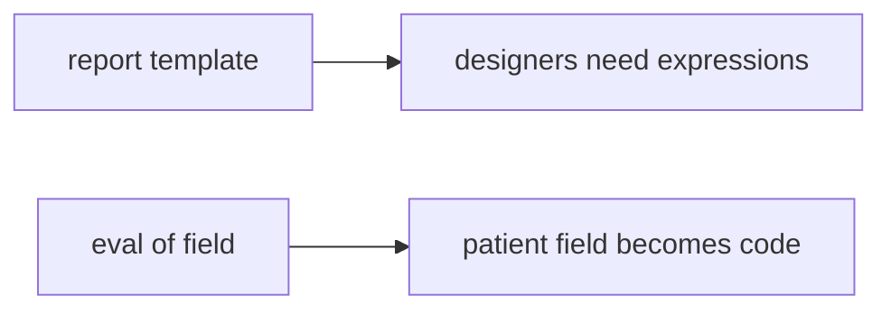

# 9.2-LO-07 — Transfer: clinic eval in a report template

**Kind:** transfer-challenge
**Loop step:** 7 Transfer
**Standards:** OWASP ASVS 5.0.0 (final) `v5.0.0-1.3.2`. Code Review Guide as guidance. SSDF 1.2 IPD remains **draft**.

## Change the workplace; keep eval off user input

Do not answer with a Top 10 / CWE / scanner as the definition of security.

**Prompt:** Clinic eval in a report template. Also name Terraform `local-exec` and GitHub Actions yaml.

**Product sketch:** EHR-lite “designers can put expressions in the discharge template,” plus “CI formatted the file so we LGTM’d.”

Rewrite the SecureCollab sentence. Include:

1. attacker capabilities (template author / compromised designer — not a live clinic);
2. trust assumptions (review of interpreters is TCB; formatter LGTM is not);
3. forbidden outcome (`review_ok` true for eval-on-user, not “HIPAA”);
4. a test idea on a **local** fixture only (no weaponized eval);
5. residual (substring stand-in, `exec(`, generated templates, E1);
6. WCAG if a human block path exists (say “eval on user input,” not only a code).

## Mental model: same interpreter, clinical object

## What graders reject

| Reject | Why |
|---|---|
| “Formatter passed” | Not an interpreter review |
| Weaponized eval / live GitHub | Lab policy |
| “AI reviewed it” | 9.4 is an aid, not 9.2 |

## Practice

One page. No keys. `labs/9.2/9.2-lab` is the only running system you may break.
