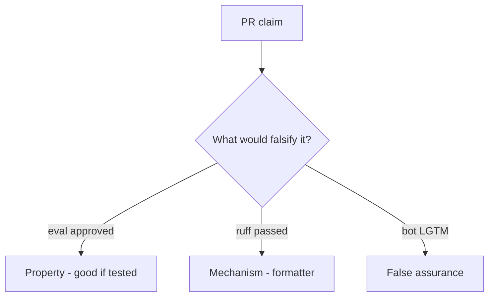

# 9.2-LO-08 — Review always-true review_ok as a PR

**Kind:** code-review
**Loop step:** Review
**Standards:** OWASP ASVS 5.0.0 (final) `v5.0.0-1.3.2`. OWASP Code Review Guide v2 as guidance.

## Review the fixture as if it were SecureCollab merge gating

Review `labs/9.2/9.2-lab/vulnerable/` as a SecureCollab PR. Your job is not to count suspicious lines. Reconstruct whether `review_ok("x = eval(user)")` still returns true, compare that with the module invariant, and write changes a developer can verify.

Intended findings live only in `content/assessment/keys/9.2.md` — not here. Do not open the keys file until your review has been evaluated.

## Mental model: LGTM on eval(user)

Start with this seeded smell: **LGTM on `eval(user)`**. Label it property, mechanism, or false assurance before you accept the PR.

Classification starts at the protected effect (eval-on-user rejected). Everything that is not an interpreter question at that call is a candidate always-approve path. A formatter screenshot without that pytest is the same smell, not a different finding class.

The lab substring is a stand-in — name `exec(` and E1 as residuals, do not skip `test_eval_on_user_input_is_rejected`. Do not dump weaponized eval. Do not claim Gate 9.

## Seeded smells (label them yourself)

- LGTM on `eval(user)`
- Reviewer only read README
- Framework-generated SQL ignored
- No authority question

Also reject: weaponized eval; closing findings without re-running `test_eval_on_user_input_is_rejected`; keys in lessons; claiming Gate 9; treating the substring as a complete oracle.

## Misconceptions this module refuses

- Tests mean review is optional
- Formatters catch security
- AI review replaces 9.2
- Documenting eval is rejecting eval
- SSDF 1.2 IPD is final

## Practice

Write three review notes a maintainer could act on. Each note: observation, property or false assurance, suggested structural change, residual you will **not** delete. Tie at least one to `test_eval_on_user_input_is_rejected`.

## Transfer

Clinic PR that “CI formatted the template” without an interpreter question is an incomplete review. Name the independent falsehood that would still keep eval-on-user rejected.

## Non-goals

Do not merge by adding a comment “will ban eval later.” That comment is a residual without an owner. Do not run eval on live input to prove the finding.
