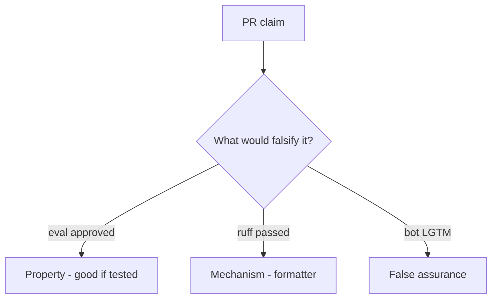

# 9.2-LO-08 — Review always-true review_ok as a PR

**Kind:** code-review
**Loop step:** Review
**Standards:** OWASP ASVS 5.0.0 (final) `v5.0.0-1.3.2`. OWASP Code Review Guide v2 as guidance.

## Review the fixture as if it were SecureCollab merge gating

Review `labs/9.2/9.2-lab/vulnerable/` as a SecureCollab PR. Intended findings live only in `content/assessment/keys/9.2.md` — not here.

## Mental model: property, mechanism, or false assurance

Seeded smells (label them yourself; do not open the keys file):

- LGTM on `eval(user)`
- Reviewer only read README
- Framework-generated SQL ignored
- No authority question

Also reject: weaponized eval, keys in lessons, claiming Gate 9, treating the substring as a complete oracle.

## Misconceptions

- Tests mean review is optional
- Formatters catch security
- AI review replaces 9.2

## Practice

Write three review notes. Tie at least one to `test_eval_on_user_input_is_rejected`.

## Transfer

Clinic PR that “CI formatted the template” without an interpreter question is incomplete.
