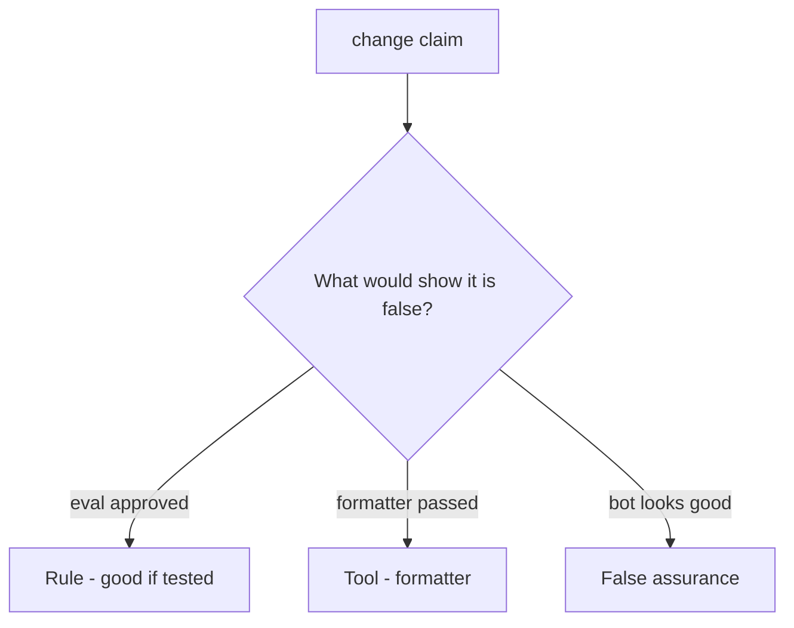

# Would you merge this always-true review_ok?

**Kind:** code-review
**Loop step:** Review

## What you are reviewing

You are reviewing merge gating. Label each claim **rule**, **tool**, or **false assurance**. Say whether `review_ok("x = eval(user)")` still returns true if they ship. Start at always-true `review_ok`, not at a scanner color.

A comment “will ban eval later” is not a pass on `test_eval_on_user_input_is_rejected`.

## Picture: approved eval(user)

**approved `eval(user)`**.

Eval-on-user still has to be rejected. If the change never asks an interpreter question, that always-approve leftover is still open. A formatter screenshot does not replace that check.

The lab substring is a stand-in — name `exec(` and generated code as leftover, do not skip `test_eval_on_user_input_is_rejected`. Do not dump weaponized eval. Do not claim a course gate.

## Problems to find (name them yourself)

- Approved `eval(user)`
- Reviewer only read README
- Framework-generated SQL ignored
- No who-is-allowed question

Also reject: weaponized eval; closing findings without re-running `test_eval_on_user_input_is_rejected`; keys in learner notes; claiming a course gate; treating the substring as a complete check.

## Common mix-ups

- Tests mean review is optional
- Formatters catch security
- A later review bot replaces this topic
- Writing down that eval is dangerous is rejecting eval
- A later draft vocabulary is final

## Use it somewhere new

Clinic change that “continuous integration formatted the template” without an interpreter question is an incomplete review. Name the independent falsehood that would still keep eval-on-user rejected.

## What this page is not doing

Do not merge by adding a comment “will ban eval later.” That comment is leftover without an owner. Do not run eval on live input to prove the finding.
