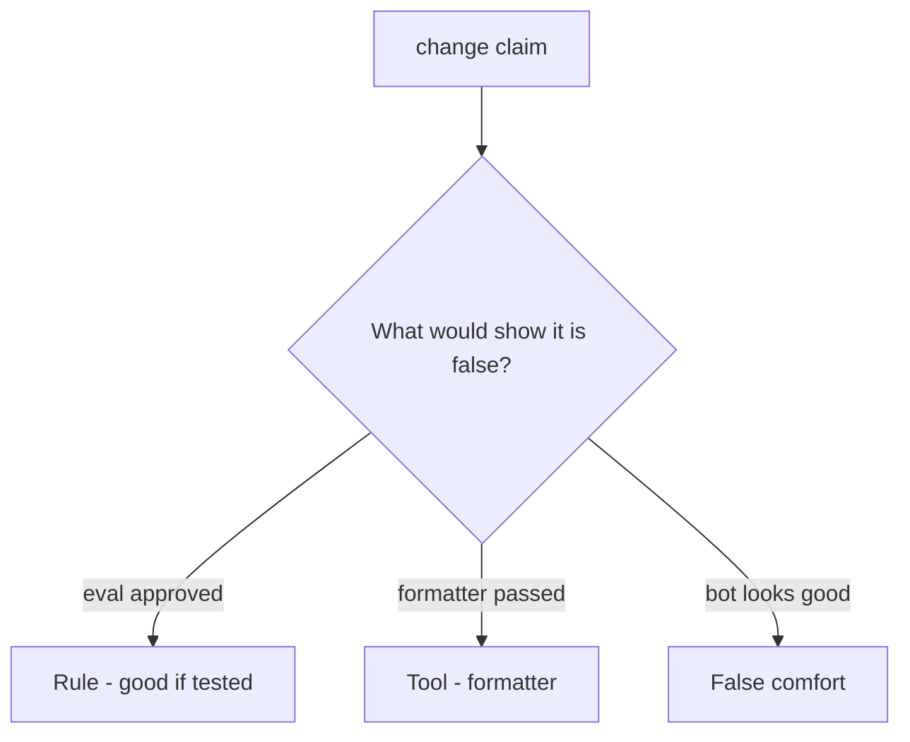

# Review always-true review_ok like a pull request

**Kind:** code-review
**Loop step:** Review

Intended findings live only in the answer-key folder — not here. Do not open that file until your review has been evaluated.

## What you are reviewing

A colleague ships notes-app merge gating. Your job is to label each claim **rule**, **tool**, or **false comfort**, and to say whether `review_ok("x = eval(user)")` still returns true if they ship. Start at always-true `review_ok`, not at a scanner color.

The folder `labs/9.2/9.2-lab/vulnerable/` is the change. The check you already ran (`test_eval_on_user_input_is_rejected`) is the rule test. A comment “will ban eval later” is not.

## Picture: approved eval(user)

Start with this seeded smell: **approved `eval(user)`**. Label it rule, tool, or false comfort before you accept the change.

The review starts at the protected effect (eval-on-user rejected). Everything that is not an interpreter question at that call is a candidate always-approve path. A formatter screenshot without that pytest is the same smell, not a different finding class.

The lab substring is a stand-in — name `exec(` and generated code as leftover, do not skip `test_eval_on_user_input_is_rejected`. Do not dump weaponized eval. Do not claim a course gate.

## Seeded smells (label them yourself)

- Approved `eval(user)`
- Reviewer only read README
- Framework-generated SQL ignored
- No who-is-allowed question

Also reject: weaponized eval; closing findings without re-running `test_eval_on_user_input_is_rejected`; keys in learner notes; claiming a course gate; treating the substring as a complete oracle.

## Common mix-ups

- Tests mean review is optional
- Formatters catch security
- A later review bot replaces this week
- Writing down that eval is dangerous is rejecting eval
- A later draft vocabulary is final

## Practice

Write three review notes a maintainer could act on. Each note: what you saw, rule or false comfort, suggested structural change, leftover you will **not** delete. Tie at least one note to `test_eval_on_user_input_is_rejected`. Do not open the keys file.

## Use it somewhere new

Clinic change that “continuous integration formatted the template” without an interpreter question is an incomplete review. Name the independent falsehood that would still keep eval-on-user rejected.

## What this page is not doing

Do not merge by adding a comment “will ban eval later.” That comment is leftover without an owner. Do not run eval on live input to prove the finding.
