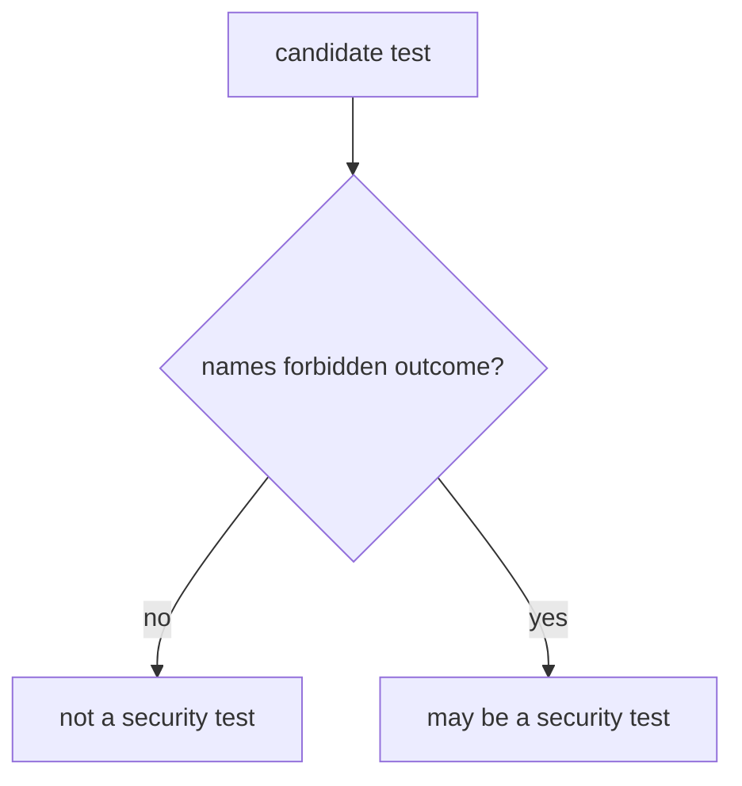
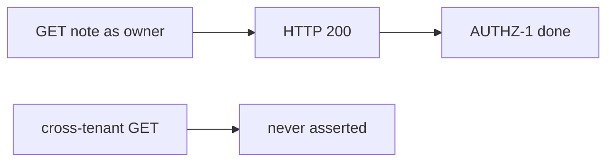

# 9.3-LO-01 — HTTP 200-only is not a security test

**Kind:** concept-model
**Loop step:** 1 Property
**Standards:** OWASP ASVS 5.0.0 (final) as a catalogue of *what*; this module owns *shape*. `v5.0.0-15.4.1` is **Level 3, advanced**. WSTG 4.2 (final). MASTG 2.0.0 (final). NIST SSDF 1.1 PW.8. SSDF 1.2 IPD and WSTG 5.0 are **draft** if cited.

## The claim this module owns

SecureCollab’s AUTHZ-1 suite must fail when tenant B reads tenant A’s note. A test that only asserts HTTP 200 on the happy path does not name that forbidden outcome. pytest-cov is not 1.2.

> `is_security_test({"status_asserted": True})` must be false. A row that names `forbidden_outcome` may count.

The forbidden outcome of *this* module is **HTTP 200-only test counted as a security test**. That is integrity of the verification suite — 9.1 can mark AUTHZ-1 “covered” with a test that never isolates.

ASVS, WSTG 4.2, and MASTG 2.0.0 tell you *what* to consider (authorization, sessions, storage). They do not make `assert r.status_code == 200` a security test. `v5.0.0-15.4.1` (shared-object concurrency / TOCTOU) is **Level 3, advanced**: if you elevate it, the test still needs a forbidden outcome (“TOCTOU must not grant”), not “the fuzzer ran.”

## Mental model: forbidden outcome



## Mental model: happy path as false assurance



**Mechanism (not the property):** pytest-cov, WSTG checklist membership, lint, a fuzzer without an oracle.

## Root cause vs impact vs prevention vs detection vs recovery

| Slice | For this property |
|---|---|
| Root cause | Happy path treated as assurance |
| Preconditions | `is_security_test` true when only `status_asserted` |
| Trigger | 9.1 maps AUTHZ-1 to that test |
| Impact | Isolation holes ship with a green suite |
| Prevention | Require a named forbidden outcome |
| Detection | `security_suite_missing_isolation` |
| Recovery | Add the isolation test; do not keep the 200-only row as security |

## Framework defaults versus the shape guarantee

FastAPI TestClient 200 is a product test. Snapshot tests are not isolation. Fuzzing without an oracle is noise (transfer / 9.5).

## Mechanism limits

- A well-shaped test can still miss a grain (7.2 fields).
- Exploratory testing remains 9.5.
- Level 3 concurrency tests still need an oracle.

## Usability and accessibility

A failing security test must state the forbidden outcome in the assertion message, not only “assert False” (WCAG 2.2 4.1.3 for human-read CI).

## Practice

Name one forbidden outcome for AUTHZ-1. Then run:

```
python3 -m pytest labs/9.3/9.3-lab/tests --impl vulnerable
python3 -m pytest labs/9.3/9.3-lab/tests --impl fixed
```

The first command must fail. The second must pass.

## Transfer

Clinic `test_get_patient_200`. Fuzzing without an oracle.

## Non-goals

Live targets, claiming Gate 9, weaponized fuzz campaigns. Gates 0–10 and M0–M5 stay **not-attempted**. Answer keys are not in this file.
