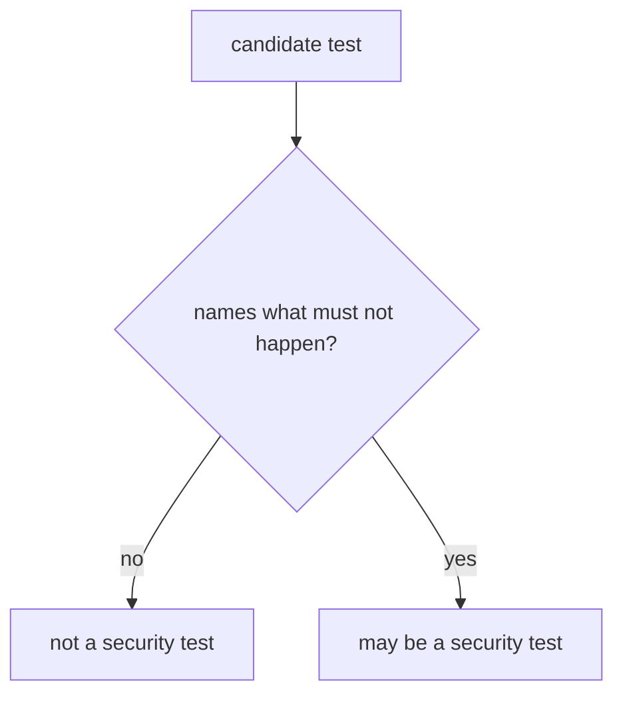
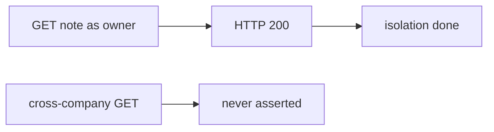

# HTTP 200-only is not a security test

**Kind:** concept-model
**Loop step:** 1 Property

## The rule

The notes app has a who-is-allowed check: a member of company B must not read a company A note. A test that only asserts HTTP 200 when the owner loads their own note does not name that what must not happen. Line coverage is not that check.

> `is_security_test({"status_asserted": True})` must be false. A row that names `forbidden_outcome` may count.

So what must not happen: **HTTP 200-only test counted as a security test**. That is honesty of the test suite — lesson 9.1 can mark the isolation row “covered” with a test that never isolates.

Checklists tell you *what* to consider (who is allowed, sessions, storage). They do not make `assert r.status_code == 200` a security test. If you add a race-condition test, it still needs a named what must not happen (“the race must not grant”), not “the fuzzer ran.”

## Picture: named what must not happen



## Picture: happy path as false assurance



**A tool, not the rule:** line coverage, a testing-guide checkbox, lint, a fuzzer with no named bad result.

## Why it happens, what it costs, how you stop it, how you notice, how you recover

Someone treated the owner’s 200 as proof that isolation works. That is the cause. A later green coverage tile is a **result**, not the cause.

| Slice | For this rule |
|---|---|
| Why it happens | Happy path treated as assurance |
| What's already wrong | `is_security_test` true when only `status_asserted` |
| Trigger | Lesson 9.1 maps the isolation row to that test |
| What it costs | Isolation holes ship with a green suite |
| How you stop it | Require a named what must not happen |
| How you notice | `security_suite_missing_isolation` |
| How you recover | Add the isolation test; do not keep the 200-only row as security |

## What the framework does vs what you still have to check

A FastAPI test client returning 200 is a product test. Snapshot tests are not isolation. Fuzzing with no named bad result is noise (later looking-around, 9.5).

`is_security_test({"status_asserted": True})` is false — files in `labs/9.3/9.3-lab`. Fake test descriptors only. No live apps.

## What the tool cannot do

- A well-shaped test can still miss a field (7.2).
- Looking around remains 9.5.
- Race-condition tests still need a named bad result.

## Can people still use it

A failing security test must say what must not happen in the assertion message, not only “assert False.” Do not encode “this failed” as color only.

## Practice

Name one what must not happen for the notes-app isolation row. Then run:

```text
python3 -m pytest labs/9.3/9.3-lab/tests --impl vulnerable
python3 -m pytest labs/9.3/9.3-lab/tests --impl fixed
```

## Use it somewhere new

Clinic `test_get_patient_200`. Fuzzing with no named bad result.

## What this page is not doing

Do not use live targets, claiming a later gate, weaponized fuzz campaigns. Answer keys are not on this site.
