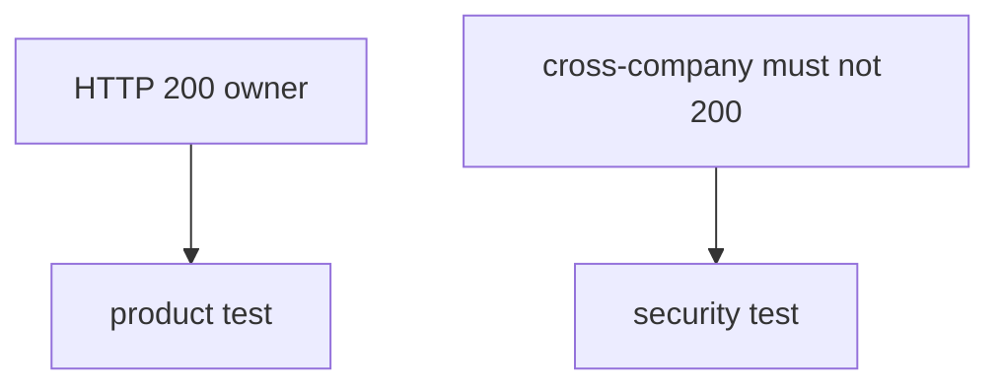
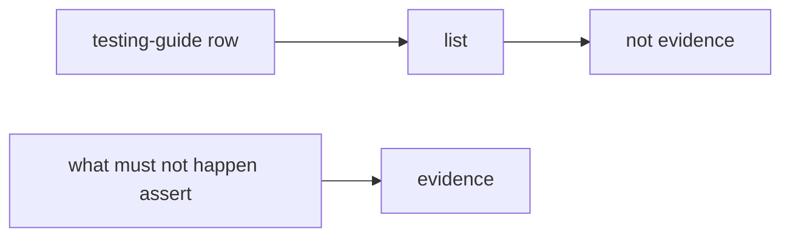

# The bad case vs the happy path

**Kind:** design-exercise
**Loop step:** 2 Model

## Could someone else name the checks?

The testable picture is **what must not happen, who is acting, and which object** — not “We ticked a testing-guide row”.

`is_security_test(t)` — no live scanners.

> For a row with only `status_asserted`, the rule is deny. A named `forbidden_outcome` may count. Watch it fail: `is_security_test({"status_asserted": True})` is true.

If the isolation row is blank about what must not happen, the suite looks green because nobody named the bad case.

## Picture: two suites

## Picture: a checklist tick is not a test

A list of things you might test is inventory. A check that names the bad case is evidence. Mixing them is how a checkbox becomes false assurance.

## Step 1: name the pieces

Take the tests you already have and ask whether each one names a bad case.

| Piece | This system |
|---|---|
| Who | Optimistic QA; empty security folder |
| What | Isolation row; HTTP 200 assert |
| Actions | `is_security_test` |
| Paths | CI |
| What you trust for this journey | The named-what must not happen check |
| What you do not trust | Line coverage; lint; a testing-guide checkbox |
| Time | The suite grows; looking around remains 9.5 |
| The rule | Honesty of the test suite |

## Step 2: write allow and deny

| Who | What | Action | Decision |
|---|---|---|---|
| status-only row | security suite | count as security test | deny |
| `forbidden_outcome` named | security suite | count as security test | may allow |
| fuzz with no named bad result | isolation row | count as covered | deny |
| testing-guide membership | suite | count as pass | deny |

A missing bad-case × isolation row is how 200-only occupies the security slot. Write the hole.

## Practice

Open `stest.py` under `labs/9.3/9.3-lab`.

## Use it somewhere new

A mobile testing-profile checkbox is a list, not a test shape.

## What can still go wrong

Looking around (9.5). Field grain (7.2). A race-condition test with no named bad result.

## What this page is not doing

Answer keys are not on this site.
