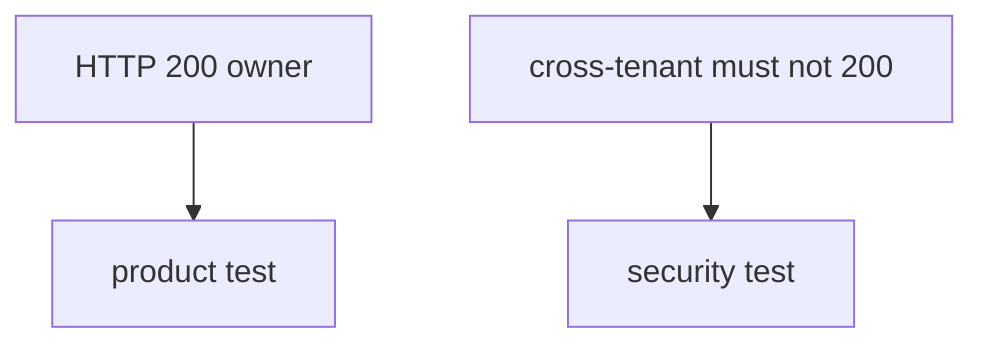
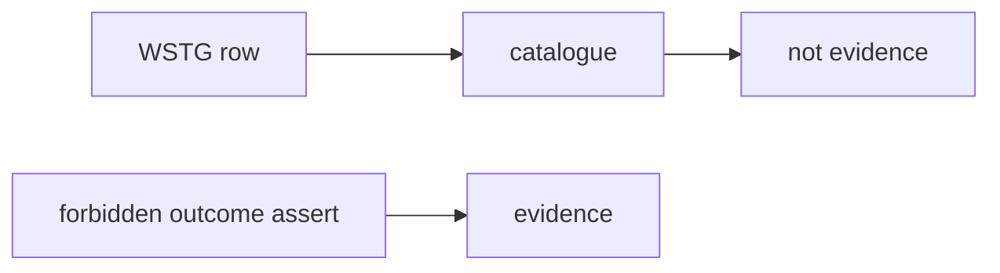

# 9.3-LO-02 — Forbidden outcome vs happy path

**Kind:** design-exercise
**Loop step:** 2 Model
**Standards:** OWASP WSTG 4.2 (final) as catalogue. ASVS `v5.0.0-8.2.1`. NIST SSDF 1.1 PW.8.

## Can a second engineer name pytest cases from your shape map?

“We have WSTG coverage” is not this lesson. A reviewable model names **the forbidden outcome, the subject, and the object**.

SecureCollab freeze: local `is_security_test(t)`. No live scanners.

## Mental model: two suites

## Mental model: lint membership is not a test

## Step 1: freeze pieces

| Piece | This system |
|---|---|
| Subjects | optimistic QA; empty security folder |
| Objects | AUTHZ-1; HTTP 200 assert |
| Actions | `is_security_test` |
| Channels | CI |
| TCB | forbidden-outcome predicate |
| Untrusted | cov %, lint, WSTG checklist |
| State / time | suite grows; 9.5 exploratory residual |
| 1.1 cell | integrity of the verification suite |

## Step 2: write cells

| Subject | Object | Action | Decision |
|---|---|---|---|
| status-only row | security suite | count as security test | deny |
| forbidden_outcome named | security suite | count as security test | may allow |
| fuzz without oracle | AUTHZ-1 | count as covered | deny |
| WSTG membership | suite | count as pass | deny |

## Practice

Draw the two suites. Point at `labs/9.3/9.3-lab` file `stest.py`.

## Transfer

MASTG: a profile checkbox is catalogue, not shape.

## Residual risk

Exploratory 9.5; field grain 7.2; concurrency L3 without an oracle.

## Non-goals

Top 10 as the definition of security. Keys stay out of lessons.
