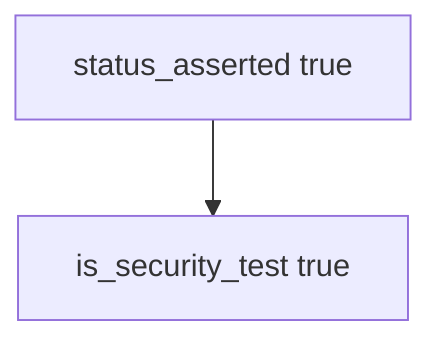

# 9.3-LO-03 — Observe status-only counted as a security test

**Kind:** mechanism-lab
**Loop step:** 3 Break
**Standards:** OWASP ASVS 5.0.0 (final) as catalogue of *what*, not shape. WSTG 4.2 (final). `v5.0.0-15.4.1` concurrency/TOCTOU is **Level 3, advanced**. WSTG 5.0 and SSDF 1.2 IPD are **draft** if cited. NIST SSDF 1.1 (final) PW.8.

## Authorized scope

`labs/9.3/9.3-lab` only. The fixture is an in-process `is_security_test(t)`. Synthetic test descriptors. No live apps, no fuzz campaigns against other hosts.

**Forbidden outcome:** HTTP 200-only test counted as a security test. `is_security_test({"status_asserted": True})` returns true.

Attacker capability in this lab: a happy-path suite treated as assurance. That stands in for clinic `test_get_patient_200`, pytest-cov 94%, or a WSTG checklist ticked without a forbidden outcome. Trust assumption: `is_security_test` is supposed to require a **named forbidden outcome**. Coverage percentage, WSTG membership, and a fuzzer without an oracle are not in the TCB for this cell.

## Mental model: status asserted is enough



The vulnerable tree demonstrates **cause** (happy path as assurance). Do not target other systems. Preconditions: `is_security_test` returns true when `status_asserted` is set. You do not need HTTP. You must not fuzz a public host.

ASVS, WSTG 4.2, and MASTG 2.0.0 tell you *what* to consider. They do not make `assert r.status_code == 200` a security test. Module 9.1 can mark AUTHZ-1 “covered” with a test that never isolates if this shape gate is missing.

## What to read in the fixture

`vulnerable/stest.py` returns true when `status_asserted` is set. Tests:

- `test_http_200_only_is_not_a_security_test`
- `test_forbidden_outcome_named_is_a_security_test` — named outcome (and maybe status too) may pass on both

You do not need a new descriptor key. The failure of `test_http_200_only_is_not_a_security_test` *is* the evidence.

Do not open the fixed tree yet. Diagnose the cause first.

## Root cause vs impact vs prevention vs detection vs recovery

| Slice | This lab |
|---|---|
| Required property | `{status_asserted: True}` → not a security test |
| Root cause | Happy-path 200 treated as assurance |
| Preconditions | `is_security_test` true when only `status_asserted` |
| Trigger | 9.1 maps AUTHZ-1 to that test |
| Impact | Isolation holes ship with a green suite |
| Prevention | Require a named forbidden outcome |
| Detection | `security_suite_missing_isolation`; never bodies |
| Recovery | Add the isolation test; keep 200-only as product tests |
| Not the lesson | A WSTG chapter; live fuzz; Gate 9 complete |

## Framework defaults versus the shape guarantee

FastAPI TestClient 200 is a product test. Snapshot tests are not isolation. pytest-cov is not 1.2. The application guarantee is: **this** fixture, 200-only is not a security test.

## Practice

```text
python3 -m pytest labs/9.3/9.3-lab/tests --impl vulnerable
```

Run from `labs/9.3/9.3-lab` if a repo-root collection picks up `site/`. Record `test_http_200_only_is_not_a_security_test`. Do not probe public hosts. An environment error is not security evidence.

## Transfer

Clinic `test_get_patient_200`: predict without leaving this directory. Do not fuzz a live EHR.

## Non-goals

No live-target or weaponized fuzz instructions. Do not claim Gate 9. WSTG 5.0 stays labeled draft if cited.
