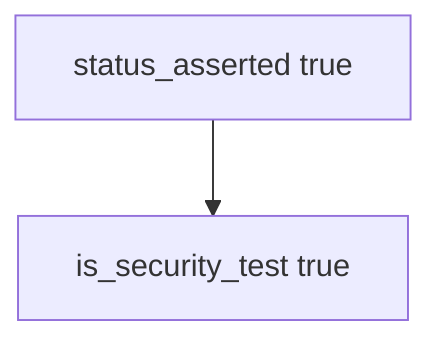

# Practice: status-only counted as a security test

**Kind:** mechanism-lab
**Loop step:** 3 Break

## Try it

The practice is not a website you attack. `is_security_test` returns a boolean: it returns true when `status_asserted` is set, so a status assert already counts as a security test.

> HTTP 200-only must not count as a security test. If `is_security_test({"status_asserted": True})` is true, the suite has failed as a security control.

## Where you may practice

Stay inside `labs/9.3/9.3-lab`. Synthetic test descriptors. No live apps, no fuzz campaigns against other hosts. Do not send the descriptors anywhere.

Do not paste this exercise onto a public host, employer clinic, or live patient system. You do not need HTTP. You must not fuzz a public host.

What must not happen: **HTTP 200-only test counted as a security test**. `is_security_test({"status_asserted": True})` returns true.

Picture a happy-path suite treated as assurance — clinic `test_get_patient_200`, line coverage at 94%, or a testing-guide checkbox ticked without a named what must not happen. `is_security_test` is supposed to require a **named what must not happen** — not Coverage percentage, testing-guide membership, or a fuzzer with no named bad result.

## Picture: status asserted is enough



You do not need a running notes server. You must not fuzz a public host. The true return is already the leak of the suite’s honesty.

Checklists tell you *what* to consider. They do not make `assert r.status_code == 200` a security test. Lesson 9.1 can mark the isolation row “covered” with a test that never isolates if this shape gate is missing.

## What to look at: the cause, not a hunt

`vulnerable/stest.py` returns true when `status_asserted` is set. Tests:

- `test_http_200_only_is_not_a_security_test`
- `test_forbidden_outcome_named_is_a_security_test` — named what must not happen (and maybe status too) may pass on both


| What you see | What kind of failure | Not the lesson |
|---|---|---|
| `status_asserted` alone returns true | Happy path counted as security | “The owner can load a note” |
| Isolation row mapped to that test | False assurance for who-is-allowed | A testing-guide chapter |
| No named what must not happen | The predicate accepted status | “We have 94% coverage” |

## Why it happens vs what it costs

| Slice | Practice |
|---|---|
| The rule | `{status_asserted: True}` → not a security test |
| Why it happens | Happy-path 200 treated as assurance |
| What's already wrong | `is_security_test` true when only `status_asserted` |
| Trigger | Lesson 9.1 maps the isolation row to that test |
| What it costs | Isolation holes ship with a green suite |
| How you stop it later | Require a named what must not happen |
| How you notice later | `security_suite_missing_isolation`; never bodies |
| How you recover later | Add the isolation test; keep 200-only as product tests |
| Out of scope | A testing-guide chapter; live fuzz; claiming a later gate |

A FastAPI test client 200 is a product test. Snapshot tests are not isolation. Line coverage is not the isolation check. 200-only is not a security test.

## Practice

```text
python3 -m pytest labs/9.3/9.3-lab/tests --impl vulnerable
```

Run from `labs/9.3/9.3-lab` if a collection at the repo root picks up `site/`. Do not probe public hosts. A setup error is not proof the rule holds.

## Use it somewhere new

Clinic `test_get_patient_200`: predict without leaving this directory. Do not fuzz a live clinic.

## What this page is not doing

No live-target or weaponized fuzz steps. Do not claim a later gate. Do not “fix” the practice by deleting the test.
