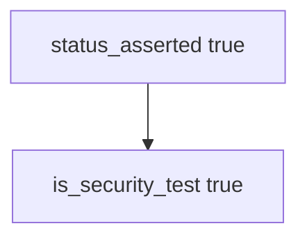

# 9.3-LO-03 — Observe status-only counted as a security test

**Kind:** mechanism-lab
**Loop step:** 3 Break
**Standards:** OWASP ASVS 5.0.0 (final) as catalogue, not shape.

## Authorized scope

`labs/9.3/9.3-lab` only. Synthetic test descriptors. No live apps or fuzz campaigns against other hosts.

**Forbidden outcome:** HTTP 200-only test counted as a security test.

## Mental model: status asserted is enough



The vulnerable tree demonstrates **cause** (happy path as assurance). Do not target other systems.

## What to read in the fixture

`vulnerable/stest.py` returns true when `status_asserted` is set. Tests require `{status_asserted: True}` to be false.

## Root cause vs impact

| Slice | Lab |
|---|---|
| Root cause | Happy-path 200 as security |
| Impact | 9.1 maps AUTHZ-1 to a non-isolating test |
| Not the lesson | A WSTG chapter as the definition |

## Practice

```
python3 -m pytest labs/9.3/9.3-lab/tests --impl vulnerable
```

Record `test_http_200_only_is_not_a_security_test`. Do not probe public hosts.

## Transfer

Clinic `test_get_patient_200`: predict without leaving this directory.

## Non-goals

No live-target or weaponized fuzz instructions.
