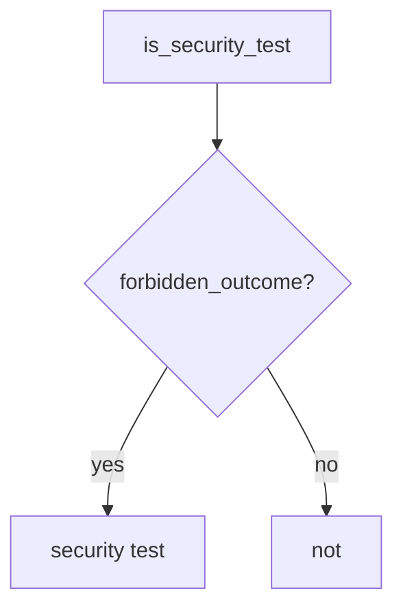

# 9.3-LO-04 — Require a named forbidden outcome

**Kind:** design-exercise
**Loop step:** 4 Build
**Standards:** OWASP ASVS 5.0.0 (final) `v5.0.0-8.2.1`. NIST SSDF 1.1 PW.8.

## Structural means the predicate looks for the forbidden outcome

`is_security_test` must require `forbidden_outcome`. HTTP 200 alone is a product test. Fail-safe: missing flag is false.

## Mental model: shape gate



Do not accept “status_asserted and we listed WSTG-ATHZ” as the flag.

## Why this restores the cell

| After the fix | Must be true |
|---|---|
| `{status_asserted: True}` | not a security test |
| `{forbidden_outcome: True, status_asserted: True}` | may be a security test |

## What this is not

pytest-cov. WSTG membership. A fuzzer without an oracle. Gate 9.

## Practice

Name the forbidden outcome for AUTHZ-1. Run:

```
python3 -m pytest labs/9.3/9.3-lab/tests --impl fixed
```

Must pass.

## Transfer

Clinic: replace `test_get_patient_200` with “other clinician must not 200.”

## Residual risk

Well-shaped tests that still miss field grain (7.2); exploratory 9.5; L3 TOCTOU (`v5.0.0-15.4.1`) without an oracle.
