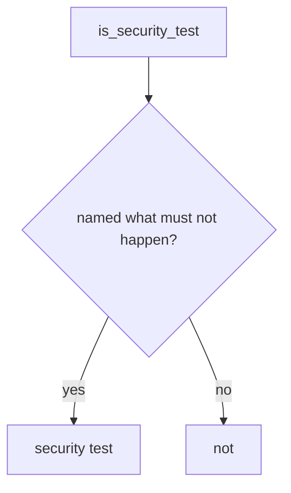

# Require a named what must not happen

**Kind:** design-exercise
**Loop step:** 4 Build

## The rule

A denylist of yesterday’s test names is not the fix. Hiding a coverage warning is not the fix. “We ticked a testing-guide row” is not the fix.

The structural change is: `is_security_test` **requires `forbidden_outcome`**. HTTP 200 alone is a product test. Structural means that flag — not line coverage, not testing-guide membership, not “status asserted and we listed a catalogue id.”

The smallest restore for the notes app’s isolation suite is: 200-only → not a security test. Fail-safe: missing flag is false. Do not fail open because coverage is 94%. Do not accept a fuzzer with no named bad result as the flag.

## Picture: shape gate



The repaired files require `forbidden_outcome`. Production still needs the named case to *match* who-is-allowed (Bob must not read Alice’s note) — a well-shaped test can still miss field grain (7.2). Looking around remains 9.5. Race-condition tests still need a named bad result (“the race must not grant”), not “the fuzzer ran.”

A testing standard that says “test against the requirement” is vocabulary. This week's check covers 200-only.

## What the repaired files must show

Read `fixed/stest.py` against this checklist. Do not treat the snippet as a production scanner.

| After the fix | Must be true |
|---|---|
| `{status_asserted: True}` | not a security test |
| `{forbidden_outcome: True, status_asserted: True}` | may be a security test |

Fail closed: if you are unsure whether a row names what must not happen, it is **not** a security test. Uncertainty is a no on “this may occupy the security slot,” not a yes because coverage looked high.

## What this is not

- Line coverage.
- Testing-guide membership.
- A fuzzer with no named bad result.
- A later gate sticker.
- Snapshot tests as isolation.
- A FastAPI test-client 200 as the isolation check.

## What the tool cannot do

- A well-shaped test can still miss a field (7.2).
- Looking around remains 9.5.
- Race-condition tests still need a named bad result.
- Lesson 9.1 can still map a lying isolation flag if people set it by mistake.

## Can people still use it

A failing security test must say what must not happen in the assertion message, not only “assert False.”

## Practice

Name the what must not happen for the isolation row (cross-company GET must not succeed). Run:

```text
python3 -m pytest labs/9.3/9.3-lab/tests --impl fixed
```

It must pass. Run from the lab directory if a collection at the repo root is polluted. Then write one sentence: which rule is restored, and which leftover you refused to delete.

## Use it somewhere new

A clinic example: replace `test_get_patient_200` with “other clinician must not 200.” The lab still uses fake descriptors.

## What can still go wrong

Well-shaped tests that still miss field grain (7.2). Looking around (9.5). A race-condition test with no named bad result.
