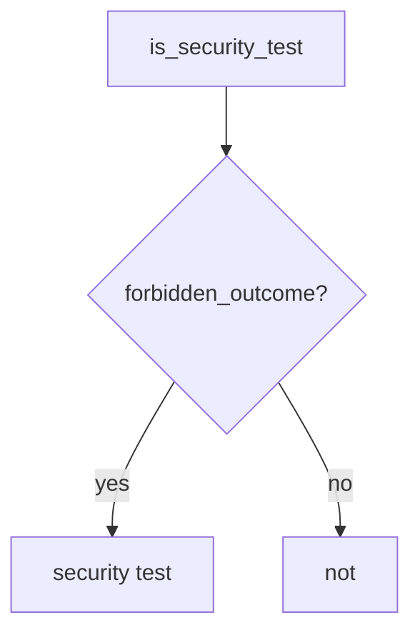

# 9.3-LO-04 — Require a named forbidden outcome

**Kind:** design-exercise
**Loop step:** 4 Build
**Standards:** OWASP ASVS 5.0.0 (final) `v5.0.0-8.2.1` as *what*; this module owns *shape*. NIST SSDF 1.1 (final) PW.8. `v5.0.0-15.4.1` is **Level 3, advanced**.

## Structural means the predicate looks for the forbidden outcome

`is_security_test` must require `forbidden_outcome`. HTTP 200 alone is a product test. Structural means that flag — not pytest-cov, not WSTG membership, not “status_asserted and we listed WSTG-ATHZ.”

The smallest restore for SecureCollab’s AUTHZ-1 suite is: 200-only → not a security test. Fail-safe: missing flag is false. Do not fail open because coverage is 94%. Do not accept a fuzzer without an oracle as the flag.

## Mental model: shape gate



The lab’s fixed tree requires `forbidden_outcome`. Production still needs the named outcome to *match* 1.2 (bob must not read alice’s note) — a well-shaped test can still miss field grain (7.2). Exploratory testing remains 9.5. Level 3 concurrency tests (`v5.0.0-15.4.1`) still need an oracle (“TOCTOU must not grant”), not “the fuzzer ran.”

SSDF 1.1 PW.8 wants tests against requirements. This pytest is that sentence for 200-only.

## Why this restores the cell

| After the fix | Must be true |
|---|---|
| `{status_asserted: True}` | not a security test |
| `{forbidden_outcome: True, status_asserted: True}` | may be a security test |

## What this is not

pytest-cov. WSTG membership. A fuzzer without an oracle. Gate 9. Snapshot tests as isolation. FastAPI TestClient 200 as AUTHZ-1.

## Mechanism limits

- A well-shaped test can still miss a grain (7.2 fields).
- Exploratory testing remains 9.5.
- Level 3 concurrency tests still need an oracle.
- 9.1 can still map a lying `asserts_isolation` flag if humans set it by mistake.

## Practice

Name the forbidden outcome for AUTHZ-1 (cross-tenant GET must not succeed). Run:

```text
python3 -m pytest labs/9.3/9.3-lab/tests --impl fixed
```

Must pass. Run from the lab directory if collection at repo root is polluted.

## Transfer

Clinic: replace `test_get_patient_200` with “other clinician must not 200.”

## Residual risk

Well-shaped tests that still miss field grain (7.2); exploratory 9.5; L3 TOCTOU (`v5.0.0-15.4.1`) without an oracle.

## Non-goals

Do not fuzz a public host. Do not claim Gate 9 from a coverage screenshot. Do not present WSTG 5.0 as final.
