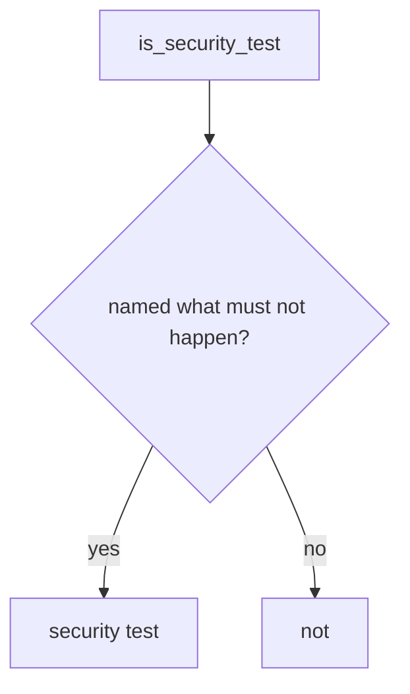

# Require a named what must not happen

**Kind:** design-exercise
**Loop step:** 4 Build

## The rule

Those test names are not a “what must not happen” assert. Hiding a coverage warning does not turn a 200-check into a security test. Ticking a testing-guide row is still a slogan.

Repair this: `is_security_test` **requires `forbidden_outcome`**. HTTP 200 alone is a product test. Put simply, that flag — not line coverage, not testing-guide membership, not “status asserted and we listed a guide id.”

The check in the notes app’s isolation suite: 200-only → not a security test. Missing flag is false. 94% coverage does not make a 200-only row a security test. A fuzzer with no named bad result is not the flag.

## Picture: shape gate



The test has to name `forbidden_outcome`. A well-shaped test can still miss field grain (7.2) if the named case is not Bob-must-not-read-Alice. Looking around remains 9.5. Race-condition tests still need a named bad result (“the race must not grant”), not “the fuzzer ran.”

A testing standard that says “test against the requirement” is vocabulary — 200-only.

## What the repaired files must show

`fixed/stest.py` classifies a 200-only row, not a clinic suite.

| After the fix | Must be true |
|---|---|
| `{status_asserted: True}` | not a security test |
| `{forbidden_outcome: True, status_asserted: True}` | may be a security test |

If you are unsure whether a row names what must not happen, it is **not** a security test. High coverage does not put it in the security slot.

## What this is not

- Line coverage.
- Testing-guide membership.
- A fuzzer with no named bad result.
- A later gate sticker.
- Snapshot tests as isolation.
- A FastAPI test-client 200 as the isolation check.

## What the tool cannot do

- A well-shaped test can still miss a field (7.2).
- Looking around remains 9.5.
- Race-condition tests still need a named bad result.
- Lesson 9.1 can still map a lying isolation flag if people set it by mistake.

## Can people still use it

A failing security test must say what must not happen in the assertion message, not only “assert False.”

## Practice

Name the what must not happen for the isolation row (cross-company GET must not succeed). Run:

```text
python3 -m pytest labs/9.3/9.3-lab/tests --impl fixed
```

## Use it somewhere new

Replace `test_get_patient_200` with “other clinician must not 200.” The lab still uses fake descriptors.

## What can still go wrong

Well-shaped tests that still miss field grain (7.2). Looking around (9.5). A race-condition test with no named bad result.
