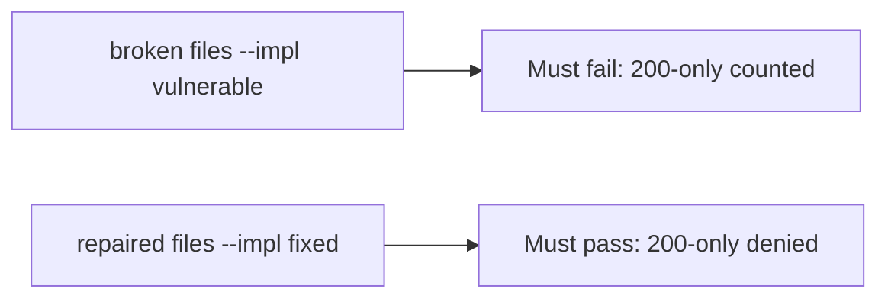

# A broken suite must fail the check

**Kind:** verification-lab
**Loop step:** 5 Verify

## Until you can fail it, it is still a slogan

“Coverage 92%” is not evidence. “The testing-guide row is ticked” is a tool observation. The check is: `is_security_test({"status_asserted": True})` is false and a row that names `forbidden_outcome` may count. That 200-only observation must be **false** on the broken files and **true** on the repaired files. Do not fuzz public hosts.

## Picture: a broken suite must fail the check

A check that only counts passing tests can still look green while 200-only still counts as security.



If both pass, the test is not looking at `status_asserted` alone. If both fail, the fix is not structural or the check is wrong.

## What the check has to show

| Mode | Must show for this topic |
|---|---|
| Normal | `forbidden_outcome` named (and maybe status too) → is a security test (may pass on both) |
| Wrong input | status-only → not a security test; broken files must fail |
| Abuse | fuzz with no named bad result must not count as covered |
| Not claimed | a real testing-guide assessment; a later gate; fuzz oracles; that the named case matches who-is-allowed |

The file is `labs/9.3/9.3-lab/tests/test_property.py`. The test `test_http_200_only_is_not_a_security_test` is there so a 200-only row cannot count as a security test.

Honest `{forbidden_outcome: True, status_asserted: True}` may pass on both implementations. That does not excuse the 200-only deny test. If the broken files do not fail `test_http_200_only_is_not_a_security_test`, the lab is miswired — fix the wiring, not the assertion.

```text
python3 -m pytest labs/9.3/9.3-lab/tests --impl vulnerable
python3 -m pytest labs/9.3/9.3-lab/tests --impl fixed
```

A test that only greps a testing-guide id in a checklist without calling `is_security_test({"status_asserted": True})` is not this topic's evidence. This practice never opens a live app.

## What the tests do not prove

- That the named case actually matches who-is-allowed
- Looking-around coverage (9.5)
- Device mobile-testing checks
- Race-condition tests with a named bad result
- A later gate complete

Record those as leftover or later topics, not as silent passes.

## Practice

Run both this session from the lab directory if needed:

```text
python3 -m pytest labs/9.3/9.3-lab/tests --impl vulnerable
python3 -m pytest labs/9.3/9.3-lab/tests --impl fixed
```

Paste nothing from answer keys. Write fail/pass into your notes next to the isolation row. Reject a “test” that only greps a catalogue name without calling `is_security_test({"status_asserted": True})`.

## Use it somewhere new

A clinic example: a test that only asserts the patient page loads is not this topic. A live fuzz call is out of scope.

## What this page is not doing

Do not treat a live fuzz screenshot as proof. Do not log note bodies. Answer keys are not on this site.
