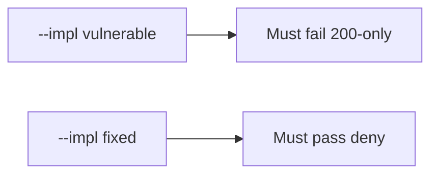

# 9.3-LO-05 — Evidence is 200-only denied, then a passing pair

**Kind:** verification-lab
**Loop step:** 5 Verify
**Standards:** OWASP ASVS 5.0.0 (final) as catalogue. This module owns shape.

## An invariant that cannot fail a test is still a slogan

“Coverage 92%” is not evidence. The oracle is the local pair. Do not fuzz public hosts.

## Mental model: vulnerable must fail: 200-only

The failing observation on `--impl vulnerable` is **200-only**. A passing collection count is not this cell.



| Case | Must show |
|---|---|
| Negative / abuse | status-only → not a security test |
| Normal | forbidden_outcome named (and maybe status too) → is a security test |
| Not claimed | real WSTG assessment; Gate 9; fuzz oracles |

```
python3 -m pytest labs/9.3/9.3-lab/tests --impl vulnerable
python3 -m pytest labs/9.3/9.3-lab/tests --impl fixed
```

Honest `{forbidden_outcome: True, status_asserted: True}` may pass on both.

## What the tests do not prove

- That the named outcome actually matches 1.2
- Exploratory coverage (9.5)
- Device MASTG tests

## Practice

Execute both implementations. Map each test to an LO-02 cell.

## Transfer

Clinic: a test that only asserts the patient page loads is not this cell.
