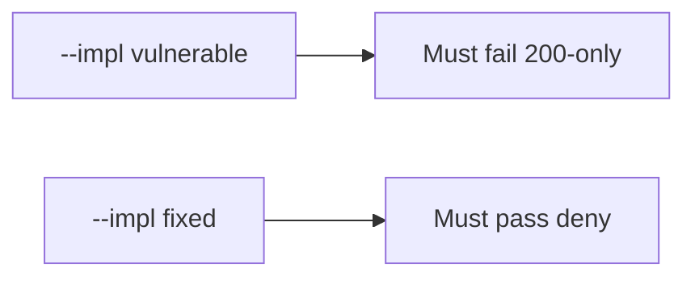

# 9.3-LO-05 — Evidence is 200-only denied, then a passing pair

**Kind:** verification-lab
**Loop step:** 5 Verify
**Standards:** OWASP ASVS 5.0.0 (final) as catalogue. This module owns shape. WSTG 4.2 (final).

## An invariant that cannot fail a test is still a slogan

“Coverage 92%” is not evidence. “WSTG is ticked” is a mechanism observation. The oracle is: `is_security_test({"status_asserted": True})` is false and a row that names `forbidden_outcome` may count. The 200-only observation must be **false** on `--impl vulnerable` (returns true) and **true** on `--impl fixed`. Do not fuzz public hosts.

## Mental model: vulnerable must fail: 200-only

The failing observation on `--impl vulnerable` is **200-only**. A passing collection count is not this cell.



| Mode | Must show for this module |
|---|---|
| Negative / abuse | status-only → not a security test; vulnerable must fail |
| Normal | forbidden_outcome named (and maybe status too) → is a security test |
| Not claimed | real WSTG assessment; Gate 9; fuzz oracles; that the named outcome matches 1.2 |

Lab tests in `labs/9.3/9.3-lab/tests/test_property.py`. `test_http_200_only_is_not_a_security_test` is a **forbidden-outcome** test: a 200-only row is not allowed to count as a security test.

```text
python3 -m pytest labs/9.3/9.3-lab/tests --impl vulnerable
python3 -m pytest labs/9.3/9.3-lab/tests --impl fixed
```

Honest `{forbidden_outcome: True, status_asserted: True}` may pass on both implementations. That does not excuse the 200-only deny test. If vulnerable does not fail `test_http_200_only_is_not_a_security_test`, the lab is miswired—fix the wiring, not the assertion.

## What the tests do not prove

- That the named outcome actually matches 1.2
- Exploratory coverage (9.5)
- Device MASTG tests
- Level 3 TOCTOU (`v5.0.0-15.4.1`)
- Gate 9 complete

Record those as residuals or later modules, not as silent passes.

## Practice

Execute both implementations this session from the lab directory if needed. Write the fail/pass pair next to the matrix row. Reject a “test” that only greps `WSTG` in a checklist without calling `is_security_test({"status_asserted": True})`.

## Transfer

Clinic: a test that only asserts the patient page loads is not this cell. Public fuzz is out of scope.

## Non-goals

Do not add a live fuzz trophy. Do not log note bodies. Keys stay out of this file. Gate 9 stays not-attempted.
