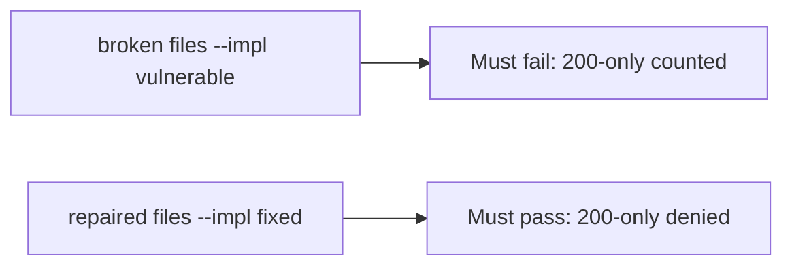

# A broken suite must fail the check

**Kind:** verification-lab
**Loop step:** 5 Verify

## Check it

Coverage at 92% does not name what must not happen. A ticked testing-guide row is a checkbox. `is_security_test({"status_asserted": True})` has to be false, and a row that names `forbidden_outcome` may count. On the broken files a 200-only row still counts. On the repaired files it does not. Do not fuzz public hosts.

## Picture: a broken suite must fail the check

A passing-test tally can still hide that 200-only still counts as security.



If both pass, you are not looking at `status_asserted` alone.

## What the check has to show

| Mode | Must show for this topic |
|---|---|
| Normal | `forbidden_outcome` named (and maybe status too) → is a security test (may pass on both) |
| Wrong input | status-only → not a security test; broken files must fail |
| Abuse | fuzz with no named bad result must not count as covered |
| Not claimed | a real testing-guide assessment; a later gate; fuzz oracles; that the named case matches who-is-allowed |

The test `test_http_200_only_is_not_a_security_test` is there so a 200-only row cannot count as a security test.

A row that names the bad result and asserts status may pass on both sides. You still have to deny a test that only checks HTTP 200. If the broken files do not fail `test_http_200_only_is_not_a_security_test`, the lab is miswired — fix the wiring, not the assertion.

```text
python3 -m pytest labs/9.3/9.3-lab/tests --impl vulnerable
python3 -m pytest labs/9.3/9.3-lab/tests --impl fixed
```

A testing-guide id in a checklist is not `is_security_test({"status_asserted": True})`. This practice never opens a live app.

## What the tests do not prove

- That the named case actually matches who-is-allowed
- Looking-around coverage (9.5)
- Device mobile-testing checks
- Race-condition tests with a named bad result
- A later gate complete

## Practice

Call `is_security_test({"status_asserted": True})`. A testing-guide id in a checklist is a tick, not the isolation assert.

## Use it somewhere new

A patient page that loads is a 200, not a named isolation assert. Do not make a live fuzz call.

## What this page is not doing

A live fuzz screenshot is not a named isolation assert. Do not log note bodies. Answer keys are not on this site.
