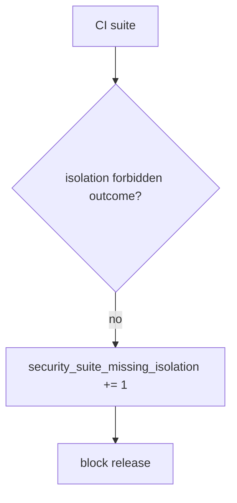

# 9.3-LO-06 — Detect security_suite_missing_isolation without logging bodies

**Kind:** operations-exercise
**Loop step:** 6 Operate
**Standards:** NIST CSF 2.0 (final) DE/RS/RC as outcome labels; NIST SSDF 1.1 PW.8.

## Prevention is not absolute

A new endpoint can land with only 200 tests. Pair detect and recover. Do not log note bodies from failed isolation cases (3.1).

## Mental model: missing isolation is a signal



| Outcome | This module |
|---|---|
| Detect | `security_suite_missing_isolation` |
| Signal | suite name, missing outcome; never bodies |
| Recover | Add the isolation test; keep 200-only as product tests |
| Residual | 9.5 exploratory; fuzz without oracle |

## Practice

Write one log line you would accept. Tie it to `labs/9.3/9.3-lab`.

```
log_denied reason=security_suite_missing_isolation req=AUTHZ-1 suite=api
```

Reject any line that includes a note body, a live fuzz payload, or “Gate 9 complete.”

## Transfer

Clinic: detect `test_get_patient_200` as the only “security” test; do not attach patient JSON to the ticket.

## Non-goals

A coverage-product name is not the property. Gate 9 stays not-attempted.
