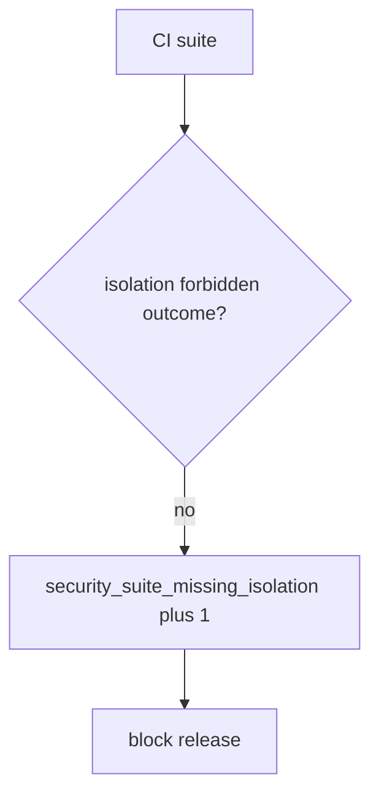

# 9.3-LO-06 — Detect security_suite_missing_isolation without logging bodies

**Kind:** operations-exercise
**Loop step:** 6 Operate
**Standards:** NIST CSF 2.0 (final) DE/RS/RC as outcome labels; NIST SSDF 1.1 (final) PW.8.

## Prevention is not absolute

A new endpoint can land with only 200 tests after `is_security_test` was “fixed once.” Pair detect and recover. Do not log note bodies from failed isolation cases (3.1). Do not attach patient JSON to the ticket.

## Mental model: missing isolation is a signal



| Outcome | This module |
|---|---|
| Detect | `security_suite_missing_isolation` |
| Signal | suite name, missing outcome; never bodies |
| Recover | Add the isolation test; keep 200-only as product tests |
| Residual | 9.5 exploratory; fuzz without oracle; 7.2 field grain |

CSF 2.0 Detect / Respond / Recover name outcomes. They do not prove PW.8. A coverage-product name is not the property. Re-run `test_http_200_only_is_not_a_security_test` after any suite change; a green “94% coverage” tile is not that pytest. Field-level tests (7.2) and TOCTOU (`v5.0.0-15.4.1`, Level 3) are other forbidden outcomes of the same shape — inventory them before claiming Recover. Keep 200-only tests as product tests; do not delete them, and do not let them occupy the security-suite slot.

## Framework defaults versus the operate guarantee

A pytest-cov dashboard will show line coverage and stay silent when AUTHZ-1 has only 200-only tests. Detection must observe **200-only is not a security test**, not percent covered. If the alert includes note bodies from a failed isolation case, you have opened a 3.1 cell.

## Practice

Write one log line you would accept. Tie it to `labs/9.3/9.3-lab`.

```text
log_denied reason=security_suite_missing_isolation req=AUTHZ-1 suite=api
```

Reject any line that includes a note body, a live fuzz payload, or “Gate 9 complete.”

## Transfer

Clinic: detect `test_get_patient_200` as the only “security” test; do not attach patient JSON to the ticket. Do not fuzz a live EHR.

## Usability

A failing security test must state the forbidden outcome in the assertion message, not only “assert False” (WCAG 2.2 Success Criterion 4.1.3 for human-read CI).

## Non-goals

A coverage-product name is not the property. Gate 9 stays not-attempted.
