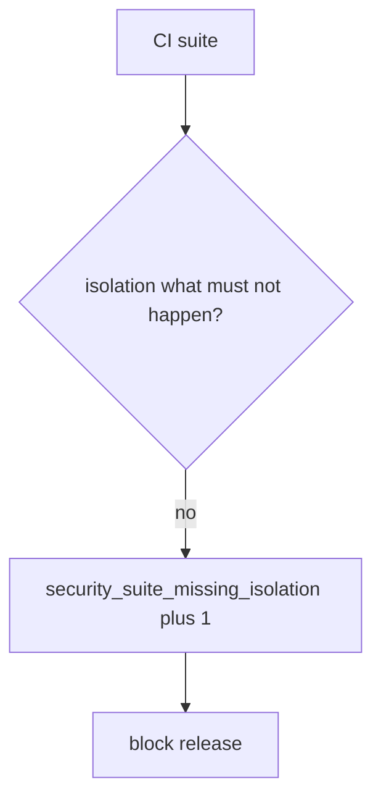

# Notice a missing isolation check, without logging notes

**Kind:** operations-exercise
**Loop step:** 6 Operate

## Fixing it once is not enough

A new endpoint can land with only 200 tests after `is_security_test` was “fixed once.” Do not log note bodies from failed isolation cases (3.1). Do not attach patient JSON to the ticket.

## Picture: missing isolation is a signal

A missing named what must not happen is a notice-and-recover problem, not a licence to quote the note in the paging channel. Notice names the suite. Recover adds the isolation test. Neither reprints the body.



A coverage product is not the rule, and an honest-suite badge is not proof.

Re-run `test_http_200_only_is_not_a_security_test` after any suite change. A green “94% coverage” tile is not that check. Field-level tests (7.2) and race-condition tests are other named what must not happen of the same shape — inventory them before you claim recover. Keep 200-only tests as product tests; do not delete them, and do not let them occupy the security-suite slot.

## Signals that do not become a second leak

| Outcome | This topic |
|---|---|
| Notice | `security_suite_missing_isolation` |
| What the line holds | Suite name, missing what must not happen; **never** bodies |
| Respond | Stop the mapping that counted 200-only as security; do not paste a failed isolation body into chat |
| Recover | Add the isolation test; keep 200-only as product tests |
| Leftover | Looking around (9.5); fuzz with no named bad result; field grain (7.2) |

A coverage dashboard will show line coverage and stay silent when the isolation row has only 200-only tests. Detection must observe **200-only is not a security test**, not percent covered. If the alert includes note bodies from a failed isolation case, you have opened the same leak as a log line (3.1).

```text
log_denied reason=security_suite_missing_isolation req=isolation suite=api
```

Not: a note body, a patient name, a live fuzz payload, or “later gate complete.”

If your alert includes the matching note body, you have copied the leak into the paging channel.

## What the framework does vs what you still have to check

The same field-grain holes, looking-around leftovers, and fuzz-with-no-named-bad-result that bypass this practice will also bypass a “scan our coverage dashboard” detector. Name those places before you claim recover. A vendor name is not this week's rule.

## Can people still use it

A failing security test must say what must not happen in the assertion message, not only “assert False.” If operators see a missing-isolation badge, do not encode it as color only.

## Practice

Write one log line you would accept in review. Tie it to `labs/9.3/9.3-lab`.

```text
log_denied reason=security_suite_missing_isolation req=isolation suite=api
```

Reject any line that includes a note body, a live fuzz payload, or “later gate complete.”

## Use it somewhere new

A clinic example: notice `test_get_patient_200` as the only “security” test; do not attach patient JSON to the ticket. Do not fuzz a live clinic.

## What this page is not doing

Live fuzz traces are out of scope. Answer keys are not on this site.
