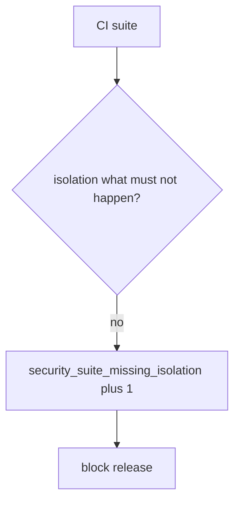

# Notice a missing isolation check, without logging notes

**Kind:** operations-exercise
**Loop step:** 6 Operate

## Fixing it once is not enough

CI can ship a new endpoint whose only security cases are HTTP 200s. Keep failed isolation bodies and patient JSON out of the ticket.

## Picture: missing isolation is a signal

If the suite never names what must not happen, page the suite — not the note. Then add the isolation test.



Coverage percent and an honesty badge do not name the isolation case.

A 200-only case is still not a security test — `test_http_200_only_is_not_a_security_test`. Ninety-four percent coverage does not name what must not happen. Field-level tests (7.2) and race-condition tests still need a named bad result; coverage percent does not complete the suite. Keep 200-only tests as product tests; do not delete them, and do not let them occupy the security-suite slot.

## Signals that do not become a second leak

| Outcome | This topic |
|---|---|
| Notice | `security_suite_missing_isolation` |
| What the line holds | Suite name, missing what must not happen; **never** bodies |
| Respond | Stop the mapping that counted 200-only as security; do not paste a failed isolation body into chat |
| Recover | Add the isolation test; keep 200-only as product tests |
| Leftover | Looking around (9.5); fuzz with no named bad result; field grain (7.2) |

A coverage dashboard will show line coverage and stay silent when the isolation row has only 200-only tests. Detection must observe **200-only is not a security test**, not percent covered. If the alert includes note bodies from a failed isolation case, you have opened the same leak as a log line (3.1).

```text
log_denied reason=security_suite_missing_isolation req=isolation suite=api
```

Not: a note body, a patient name, a live fuzz payload, or “later gate complete.”

Putting the matching note body in the alert puts the patient text in the pager too.

## What the framework does vs what you still have to check

Field-grain holes, looking-around leftovers, and fuzz with no named bad result still pass a green coverage dashboard.

## Can people still use it

A failing security test must say what must not happen in the assertion message, not only “assert False.” If operators see a missing-isolation badge, do not encode it as color only.

## Practice

```text
log_denied reason=security_suite_missing_isolation req=isolation suite=api
```

Reject any line that includes a note body, a live fuzz payload, or “later gate complete.”

## Use it somewhere new

Notice `test_get_patient_200` as the only “security” test; do not attach patient JSON to the ticket. Do not fuzz a live clinic.

## What this page is not doing

Do not use live fuzz traces. Answer keys are not on this site.
