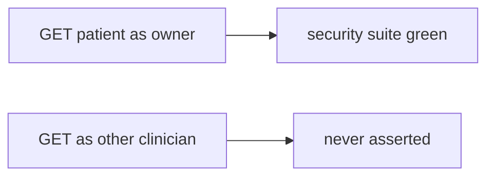

# 9.3-LO-07 — Transfer: clinic test_get_patient_200

**Kind:** transfer-challenge
**Loop step:** 7 Transfer
**Standards:** OWASP ASVS 5.0.0 (final) as catalogue. WSTG 4.2 (final). Fuzzing without an oracle is residual.

## Change the workplace; keep 200 from meaning isolation

Do not answer with a Top 10 / CWE / scanner as the definition of security.

**Prompt:** Clinic `test_get_patient_200`. Also name fuzzing without an oracle.

**Product sketch:** EHR-lite “we have 94% coverage and GET /patient/1 returns 200,” plus a WSTG checklist ticked.

Rewrite the SecureCollab sentence. Include:

1. attacker capabilities (another clinician’s token — not a live clinic);
2. trust assumptions (forbidden-outcome tests are TCB; cov % and WSTG ticks are not);
3. forbidden outcome (`is_security_test({status_asserted: True})` true, not “HIPAA”);
4. a test idea on a **local** fixture only (other clinician must not 200);
5. residual (exploratory 9.5, fuzzing without oracle, field grain 7.2);
6. WCAG if CI is human-read (assertion message names the forbidden outcome).

## Mental model: same 200, clinical object

## What graders reject

| Reject | Why |
|---|---|
| “coverage 94%” | Not 1.2 |
| Live clinic / real PHI / public fuzz | Lab policy |
| “WSTG 5.0” as final | 5.0 is in development; 4.2 is the final pin |

## Practice

One page. No keys. `labs/9.3/9.3-lab` is the only running system you may break.
