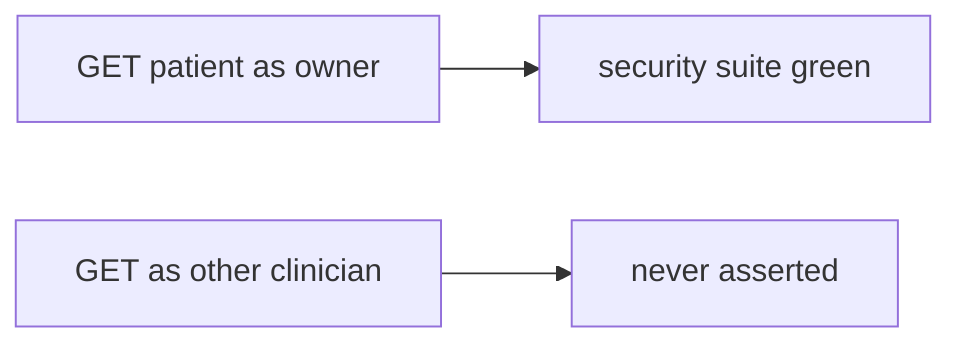

# Same idea on a clinic test that only checks 200

**Kind:** transfer-challenge
**Loop step:** 7 Transfer

## Use it somewhere new

The notes-app scaffolding goes away. You get a **clinic page test**. `test_get_patient_200` asserts the owner’s GET returns 200. Your job is to rewrite the loop, not to name a bug-list code.

The notes-app sentence was: `is_security_test({"status_asserted": True})` must be false. Rewrite it for a clinic without changing the fork: 200-only is not a security test; a named what must not happen may count. A testing-guide checkbox is still catalogue, not shape.

**Product sketch:** an EHR-lite “we have 94% coverage and GET /patient/1 returns 200,” plus a testing-guide checklist ticked.

## Picture: same 200, clinical object

Renaming “note” to “patient” is not transfer. Object, bad case, and leftover change. Enabling a coverage product and ticking the guide does not name what must not happen.

| Notes app this week | Clinic sketch |
|---|---|
| Isolation row is the requirement | Other clinician must not read this chart |
| Owner GET 200 is a product test | Owner GET 200 is a product test |
| `is_security_test({"status_asserted": True})` | Same predicate on a local practice files |
| Happy-path suite as false assurance | Same readers — **not** a live clinic |
| Cross-company GET never asserted | Other clinician GET never asserted |

If GET as owner returns 200 while the suite never asserts the other clinician, the rule is gone. Line coverage, testing-guide ticks, and a fuzzer with no named bad result do not name what must not happen. Field grain (7.2) and looking around (9.5) are the same shape family — name them, do not fuzz a live clinic here. A draft testing guide is not the current pin.

The clinic rewrite still has to keep the notes-app fork: 200-only not a security test, named what must not happen may count. Adding `test_get_patient_200` as “the security test” leaves `is_security_test({status_asserted: True})` true. The local pytest analogue is `test_http_200_only_is_not_a_security_test` — on a practice, not a live clinic.

## Prompt — clinic test_get_patient_200

Rewrite the notes-app sentence. Include:

1. who can act (another clinician’s token — not a live clinic);
2. what you trust (named-what must not happen tests are the promise; coverage percent and testing-guide ticks are not);
3. what must not happen (`is_security_test({status_asserted: True})` true, not a legal label);
4. a test idea on a **local** practice files only (other clinician must not 200);
5. leftover (looking around 9.5, fuzzing with no named bad result, field grain 7.2);
6. whether a human-read CI path exists (assertion message names what must not happen).

Use fake labels. Do not use real patient names.

## What is not good enough

| Reject | Why |
|---|---|
| “coverage 94%” | Not the isolation check |
| Live clinic / real charts / public fuzz | Course rules |
| A draft testing guide as the current pin | Draft is not the pin |
| Testing-guide tick as this topic | Catalogue, not shape |
| Snapshot test as isolation | Wrong observation |

## Practice

One page. No answer keys. `labs/9.3/9.3-lab` is the only running system you may break. Do not fuzz a public host.

## What this page is not doing

Live-target fuzz. Real patient charts. Claiming you finished a later gate from this page.
