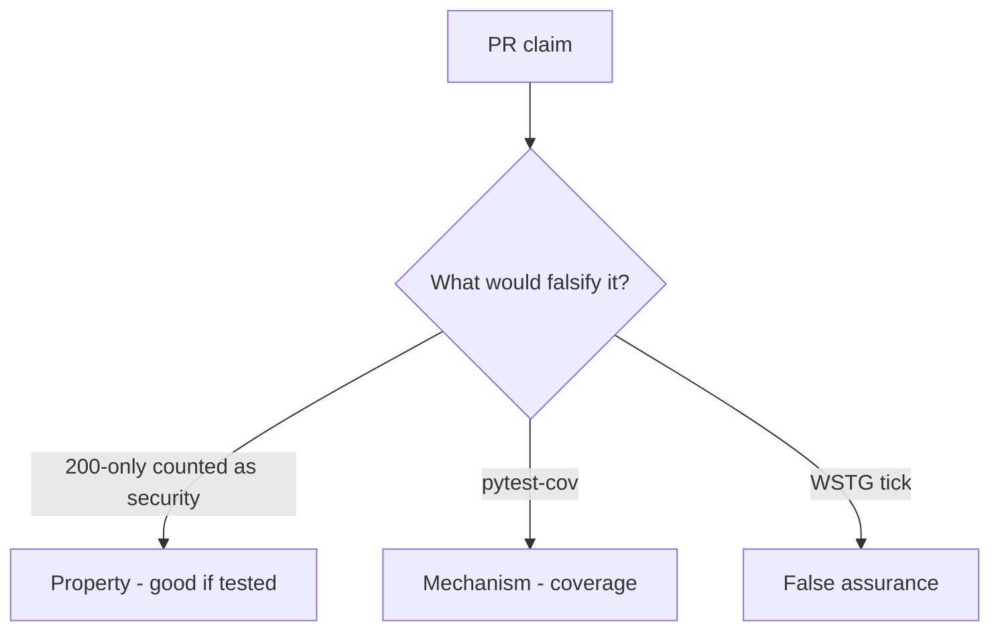

# 9.3-LO-08 — Review status-only is_security_test as a PR

**Kind:** code-review
**Loop step:** Review
**Standards:** OWASP ASVS 5.0.0 (final) as catalogue. WSTG 4.2 (final).

## Review the fixture as if it were SecureCollab’s security suite gate

Review `labs/9.3/9.3-lab/vulnerable/` as a SecureCollab PR. Intended findings live only in `content/assessment/keys/9.3.md` — not here.

## Mental model: property, mechanism, or false assurance

Seeded smells (label them yourself; do not open the keys file):

- `assert r.status_code==200` only
- No cross-tenant test
- Security suite empty
- Chaos / fuzz without authz oracle

Also reject: live targets, keys in lessons, claiming Gate 9, treating cov % as 1.2.

## Misconceptions

- Coverage is security
- Fuzzing finds all authz bugs
- Snapshot tests are isolation tests

## Practice

Write three review notes. Tie at least one to `test_http_200_only_is_not_a_security_test`.

## Transfer

Clinic PR that “added test_get_patient_200 as the security test” is incomplete.
