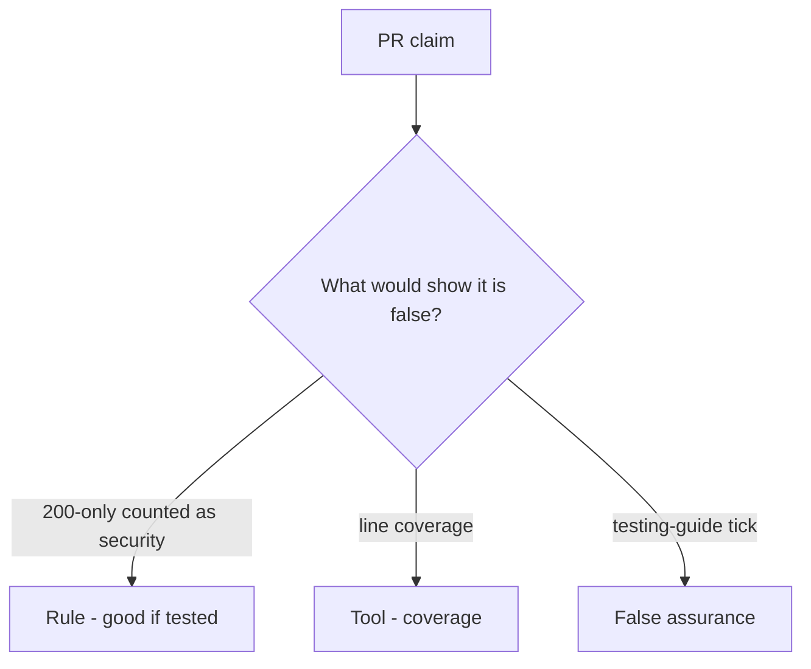

# Would you merge this status-only is_security_test?

**Kind:** code-review
**Loop step:** Review

## What you are reviewing

Review `labs/9.3/9.3-lab/vulnerable/` as a change to the notes app’s security-suite gate. Check whether `{status_asserted: True}` still counts as a security test.

Look at `is_security_test` and the 200-only row. Coverage color is not the review. If `test_http_200_only_is_not_a_security_test` still fails, “will add isolation later” is unfinished work.

## Picture: assert r.status_code==200 only

**`assert r.status_code==200` only**.

200-only is not a security test. If the change never names what must not happen, that happy-path leftover is still open. A coverage screenshot does not replace that check.

Fuzz with no named bad result is leftover 9.5. Field grain is 7.2. Do not claim a later gate. Do not treat coverage percent as the isolation check.

## Problems to find (name them yourself)

- `assert r.status_code==200` only
- No cross-company test
- Security suite empty
- Chaos / fuzz with no who-is-allowed named bad result

Also reject: live targets; closing findings without re-running `test_http_200_only_is_not_a_security_test`; keys in learner notes; claiming a later gate; treating coverage percent as the isolation check.

## Common mix-ups

- Coverage is security
- Fuzzing finds all who-is-allowed bugs
- Snapshot tests are isolation tests
- A draft testing guide is the current pin
- A later gate follows from a green suite

## Use it somewhere new

Adding `test_get_patient_200` as the security test still treats HTTP 200 as security. What still has to be named so HTTP 200 alone is not a security test?

## Can people still use it

A failing security test must say what must not happen in the assertion message, not only “assert False.”

## What this page is not doing

A 200-only suite with only “will add isolation later” has no owner for the isolation check. Do not fuzz a public host to prove the finding.
