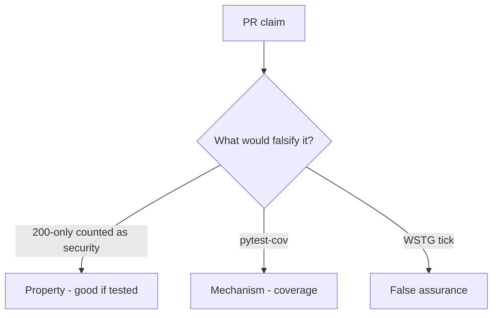

# 9.3-LO-08 — Review status-only is_security_test as a PR

**Kind:** code-review
**Loop step:** Review
**Standards:** OWASP ASVS 5.0.0 (final) as catalogue. WSTG 4.2 (final).

## Review the fixture as if it were SecureCollab’s security suite gate

Review `labs/9.3/9.3-lab/vulnerable/` as a SecureCollab PR. Your job is not to count suspicious lines. Reconstruct whether `{status_asserted: True}` still counts as a security test, compare that with the module invariant, and write changes a developer can verify.

Intended findings live only in `content/assessment/keys/9.3.md` — not here. Do not open the keys file until your review has been evaluated.

## Mental model: assert r.status_code==200 only

Start with this seeded smell: **`assert r.status_code==200` only**. Label it property, mechanism, or false assurance before you accept the PR.

Classification starts at the protected effect (200-only is not a security test). Everything that is not a named forbidden outcome at that call is a candidate happy-path path. A coverage screenshot without that pytest is the same smell, not a different finding class.

Chaos / fuzz without an authz oracle is 9.5 residual. Field grain is 7.2. Do not skip `test_http_200_only_is_not_a_security_test`. Do not claim Gate 9. Do not treat cov % as 1.2.

## Seeded smells (label them yourself)

- `assert r.status_code==200` only
- No cross-tenant test
- Security suite empty
- Chaos / fuzz without authz oracle

Also reject: live targets; closing findings without re-running `test_http_200_only_is_not_a_security_test`; keys in lessons; claiming Gate 9; treating cov % as 1.2.

## Misconceptions this module refuses

- Coverage is security
- Fuzzing finds all authz bugs
- Snapshot tests are isolation tests
- WSTG 5.0 is the current final pin
- Gate 9 follows from a green suite

## Practice

Write three review notes a maintainer could act on. Each note: observation, property or false assurance, suggested structural change, residual you will **not** delete. Tie at least one to `test_http_200_only_is_not_a_security_test`.

## Transfer

Clinic PR that “added test_get_patient_200 as the security test” is an incomplete verification review. Name the independent falsehood that would still keep 200-only from counting as security.

## Non-goals

Do not merge by adding a comment “will add isolation later.” That comment is a residual without an owner. Do not fuzz a public host to prove the finding.
