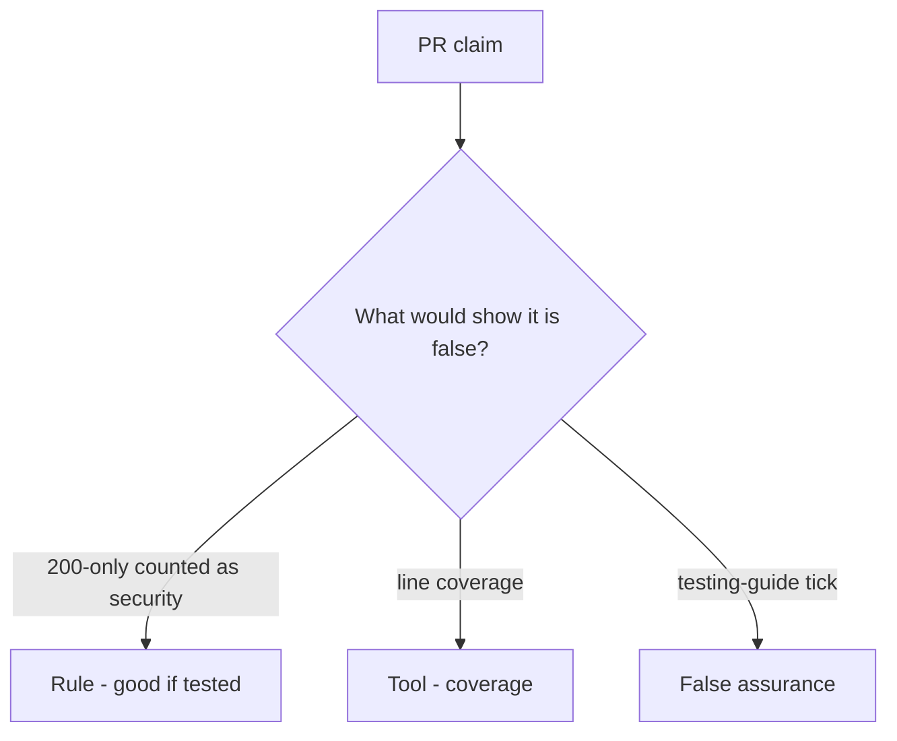

# Would you merge this status-only is_security_test?

**Kind:** code-review
**Loop step:** Review

The answers are not on this page. Do not open the keys file until someone has looked at your review.

## What you are reviewing

Review `labs/9.3/9.3-lab/vulnerable/` as a change to the notes app’s security-suite gate. Check whether `{status_asserted: True}` still counts as a security test, compare that with the rule, and write changes a developer can verify.

Start at `is_security_test` and the 200-only row, not at a scanner color or a coverage screenshot. The check you already ran (`test_http_200_only_is_not_a_security_test`) is the rule test. A comment “will add isolation later” is not.

## Picture: assert r.status_code==200 only

**`assert r.status_code==200` only**. Label it rule, tool, or false assurance before you accept the change.

200-only is not a security test. If the change never names what must not happen, that happy-path leftover is still open. A coverage screenshot does not replace that check.

Fuzz with no named bad result is leftover 9.5. Field grain is 7.2. Do not skip `test_http_200_only_is_not_a_security_test`. Do not claim a later gate. Do not treat coverage percent as the isolation check.

## Problems to find (name them yourself)

- `assert r.status_code==200` only
- No cross-company test
- Security suite empty
- Chaos / fuzz with no who-is-allowed named bad result

Also reject: live targets; closing findings without re-running `test_http_200_only_is_not_a_security_test`; keys in learner notes; claiming a later gate; treating coverage percent as the isolation check.

## Common mix-ups

- Coverage is security
- Fuzzing finds all who-is-allowed bugs
- Snapshot tests are isolation tests
- A draft testing guide is the current pin
- A later gate follows from a green suite

## Practice

Write three review notes a maintainer could act on. Each note: what you saw, rule or false assurance, suggested structural change, leftover you will **not** delete. Tie at least one note to `test_http_200_only_is_not_a_security_test`. Do not open the keys file.

## Use it somewhere new

Clinic change that “added test_get_patient_200 as the security test” is an incomplete review of whether 200-only still counts as security. Name the independent falsehood that would still keep 200-only from counting as security.

## Can people still use it

A failing security test must say what must not happen in the assertion message, not only “assert False.”

## What this page is not doing

Do not merge by adding a comment “will add isolation later.” That comment is leftover without an owner. Do not fuzz a public host to prove the finding.
