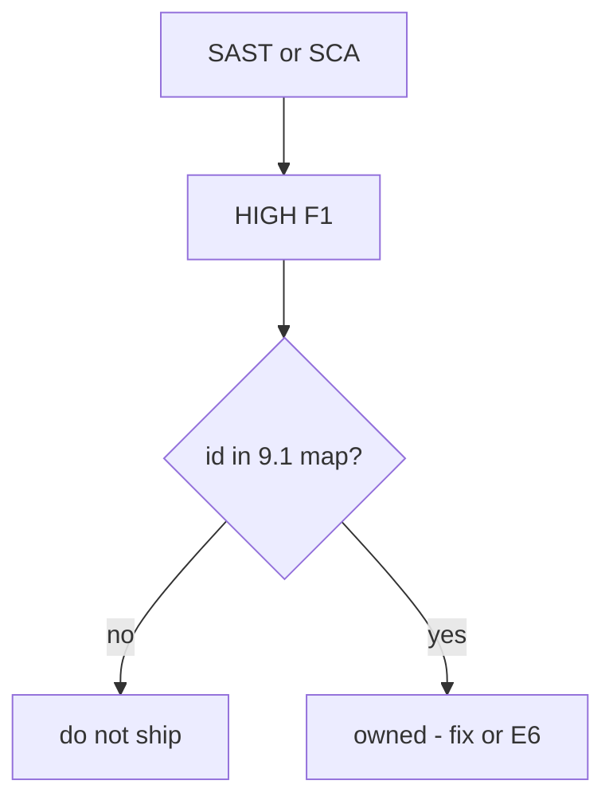
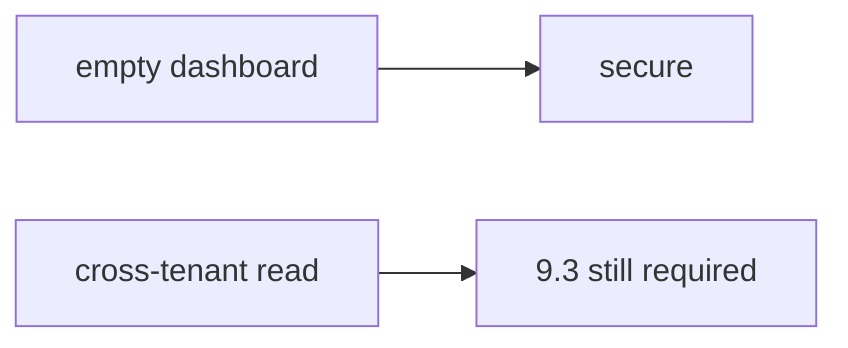

# 9.4-LO-01 — An unmapped HIGH cannot ship

**Kind:** concept-model
**Loop step:** 1 Property
**Standards:** OWASP ASVS 5.0.0 (final) `v5.0.0-15.2.1`; `v5.0.0-15.2.4` is **Level 3, advanced**. NIST SSDF 1.1 PW.7 / PW.8. OWASP SAMM 2.0 as measurement vocabulary. SSDF 1.2 IPD is **draft**.

## The claim this module owns

SecureCollab CI may run SAST, SCA, and secret scanners. A HIGH finding that is not mapped to a 9.1 requirement is **unowned**. Unowned is not “probably fine.” The ship gate is a predicate over findings and the map, not a dashboard zero.

> `ship_ok([{"id": "F1", "sev": "HIGH"}], {})` must be false.

The forbidden outcome is **unmapped HIGH finding allows ship**. That is integrity of the release decision — an unknown HIGH in prod.

ASVS `v5.0.0-15.2.1` wants components inside documented update timeframes — an SCA *signal*, not the map. `v5.0.0-15.2.4` (dependency confusion) is **Level 3, advanced** and is a common scanner blind spot: mapping “no finding” is not coverage. SAMM Verification measures whether you *triage*; it is not `ship_ok`. GitHub code scanning default is not your policy.

## Mental model: scanner is a signal



## Mental model: zero findings is not 1.2



**Mechanism (not the property):** GitHub code scanning, Semgrep default, Dependabot, a SAMM score.

## Root cause vs impact vs prevention vs detection vs recovery

| Slice | For this property |
|---|---|
| Root cause | Scanner output not joined to 9.1 |
| Preconditions | `ship_ok([HIGH], {})` true |
| Trigger | Release with unmapped HIGH |
| Impact | Unknown HIGH in prod |
| Prevention | Block unmapped HIGH; mapped+accepted needs E6 expiry |
| Detection | `unmapped_high_blocks` |
| Recovery | Map or fix; do not suppress silently |

## Framework defaults versus the ship guarantee

Code scanning “default setup” is inventory of *some* findings. Reachability may record a false positive — with an owner — it does not silently drop HIGH.

## Mechanism limits

- Authz logic (1.2 / 4.4) is a scanner blind spot — 9.2 / 9.3.
- Severity downgrade without evidence.
- Mapped HIGH that is the wrong requirement id.

## Usability and accessibility

Triage UI must be usable or people mass-suppress (WCAG 2.2 4.1.3: say *why* F1 is blocked).

## Practice

Triage one HIGH: reachability, map, or exception. Then run:

```
python3 -m pytest labs/9.4/9.4-lab/tests --impl vulnerable
python3 -m pytest labs/9.4/9.4-lab/tests --impl fixed
```

The first command must fail. The second must pass.

## Transfer

SCA CVE vs actually called function. Clinic: 50 unmapped HIGHs.

## Non-goals

Live GitHub orgs, claiming Gate 9, weaponized scanner dumps. Gates 0–10 and M0–M5 stay **not-attempted**. Answer keys are not in this file.
