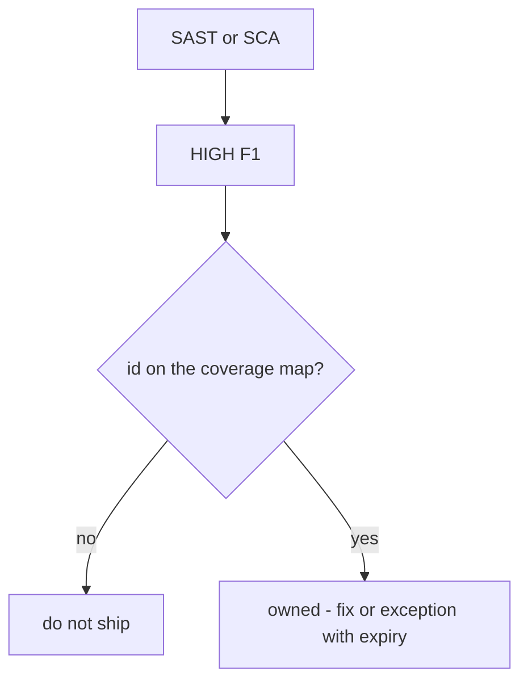
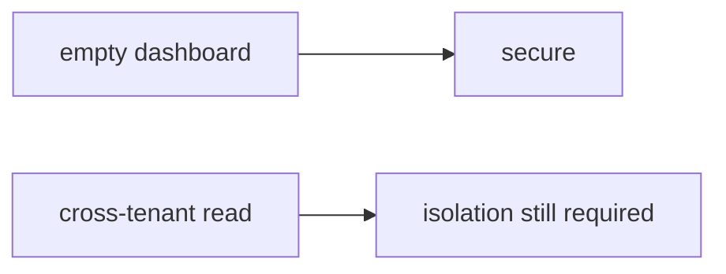

# An unmapped HIGH cannot ship

**Kind:** concept-model
**Loop step:** 1 Property

## The rule

The notes app’s CI may run SAST, SCA, and secret scanners. That is useful noise. It is not a ship decision.

A HIGH finding that is not mapped to a row on the coverage map is **unowned**. Unowned is not “probably fine.” The ship check is a join: every HIGH id against that map. An empty dashboard is not the join.

> `ship_ok([{"id": "F1", "sev": "HIGH"}], {})` must be false.

What must not happen: **an unmapped HIGH is allowed to ship**. That is integrity of the release decision. An unknown HIGH lands in production because nobody owned it.

You need to update components on a documented clock — that is an SCA *signal*, not the map. Dependency confusion is an **advanced leftover**: mapping “the scanner found nothing” is not coverage. A maturity score measures whether you *triage*. It is not `ship_ok`. A vendor’s default setup is not your policy.

## Picture: the scanner is a signal



## Picture: zero findings is not isolation



**A tool, not the rule:** a vendor’s default code scanning, a default Semgrep ruleset, Dependabot, or a maturity score on a slide.

## Who can make an unmapped HIGH ship

| Person | What they can do here | Motive | Harm if HIGH is unowned |
|---|---|---|---|
| Alert-fatigued reviewer | Click through a noisy dashboard | Ship on Friday | Unknown HIGH in production |
| Vendor dashboard | Show empty or noisy counts | Look green | No join to the coverage map |
| Someone with a score on a slide | Treat the score as the gate | Pass an audit | Same unowned HIGH |

You do not need a live GitHub org. Those three already ship the finding.

## Why it happens, what it costs, how you stop it, how you notice, how you recover

Scanner output was never joined to the coverage map. That's the unmapped finding. The person who later reads production is who pays for it.

| Slice | For this rule |
|---|---|
| Why it happens | Scanner output not joined to the coverage map |
| What's already wrong | `ship_ok([HIGH], {})` is true |
| Trigger | Release with an unmapped HIGH |
| What it costs | Unknown HIGH in production |
| How you stop it | Block unmapped HIGH; a mapped HIGH you accept still needs an exception with an expiry |
| How you notice | `unmapped_high_blocks` |
| How you recover | Map it or fix it; do not hide it quietly |

## What the framework does vs what you still have to check

A vendor “default setup” inventories *some* findings. Reachability may record a false positive — **with an owner** — it does not silently drop HIGH.

`ship_ok` with a HIGH and an empty map is deny — files in `labs/9.4/9.4-lab`. Fake finding id `F1` only. No live GitHub. No scanning other people’s repos.

## What the tool cannot do

- Who-is-allowed logic (isolation / object checks) is a scanner blind spot — you still need review and isolation tests.
- A severity downgrade with no evidence.
- A mapped HIGH that points at the wrong requirement id.

## Can people still use it

The triage screen must be usable or people mass-suppress. Say *why* F1 is blocked, in words. Do not encode “blocked” as color only.

## Practice

Triage one HIGH: reachable, mapped, or an exception with an owner. Then run the local pair:

```text
python3 -m pytest labs/9.4/9.4-lab/tests --impl vulnerable
python3 -m pytest labs/9.4/9.4-lab/tests --impl fixed
```

## Use it somewhere new

SCA: a CVE versus a function you actually call. Fifty unmapped HIGHs is the same unowned pile.

## What this page is not doing

Do not use live GitHub orgs. This SCA lesson is not a finished check-in. Do not paste weaponized scanner dumps. Answer keys are not on this site.
