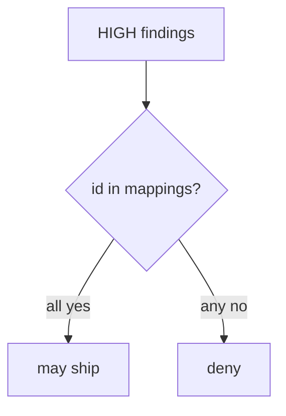
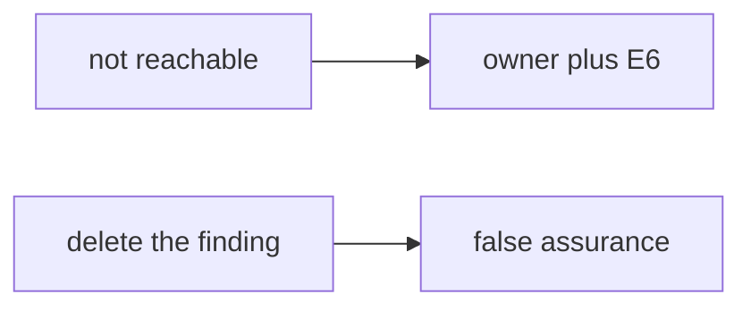

# 9.4-LO-02 — Scanner output joined to the 9.1 map

**Kind:** design-exercise
**Loop step:** 2 Model
**Standards:** OWASP ASVS 5.0.0 (final) `v5.0.0-15.2.1`. NIST SSDF 1.1 RV.1.

## Can a second engineer name pytest cases from your join?

“We turned on code scanning” is not this lesson. A reviewable model names **finding id, severity, mapped requirement, and owner**.

SecureCollab freeze: local `ship_ok(findings, mappings)`. No live tenants.

## Mental model: join before ship

## Mental model: reachability is a record, not a drop

## Step 1: freeze pieces

| Piece | This system |
|---|---|
| Subjects | alert-fatigued reviewer; vendor dashboard |
| Objects | HIGH finding; 9.1 requirement id |
| Actions | `ship_ok` |
| Channels | CI artifact |
| TCB | mapping predicate |
| Untrusted | scanner default; SAMM score; empty dashboard |
| State / time | exception expiry (E6) |
| 1.1 cell | integrity of the release decision |

## Step 2: write cells

| Subject | Object | Action | Decision |
|---|---|---|---|
| unmapped HIGH | release | ship | deny |
| mapped HIGH | release | ship | may allow after fix or E6 |
| empty dashboard | AUTHZ-1 | treat as covered | deny |
| suppression no owner | HIGH | drop | deny |

## Practice

Draw the join. Point at `labs/9.4/9.4-lab` file `sast.py`.

## Transfer

SCA: CVE mapped to a function you do not call still needs an owner.

## Residual risk

Authz blind spots; Level 3 `v5.0.0-15.2.4`; mass suppressions.

## Non-goals

Top 10 as the definition of security. Keys stay out of lessons.
