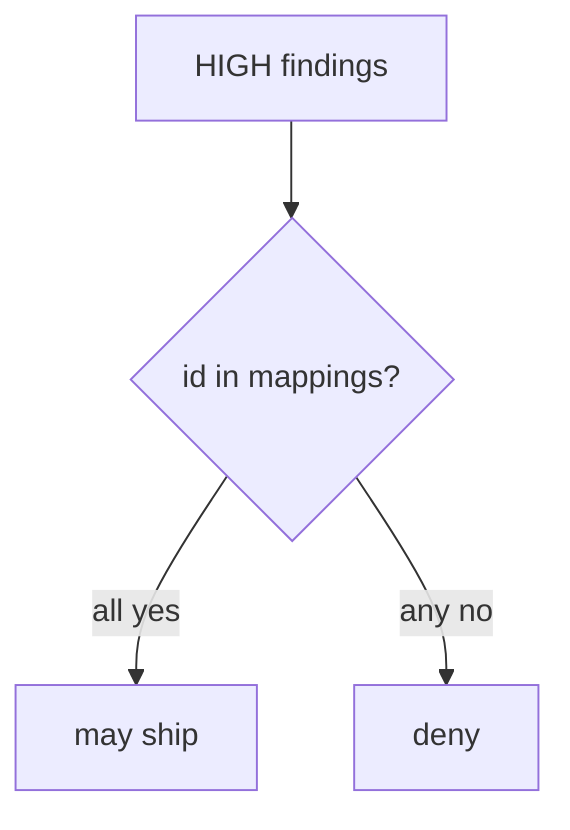
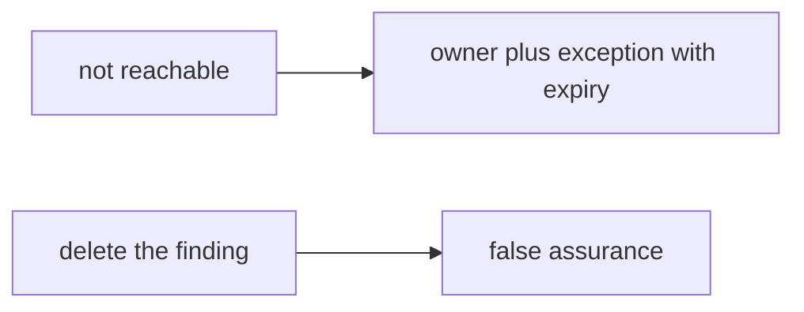

# Scanner output joined to the coverage map

**Kind:** design-exercise
**Loop step:** 2 Model

## Could someone else name the checks?

“We turned on code scanning” does not name **finding id, severity, mapped requirement, and owner**.

`ship_ok(findings, mappings)` — no live tenants.

> For a HIGH finding at `ship_ok`, the rule is deny unless that id is on the map. Evidence that the deny is false: `ship_ok([{"id": "F1", "sev": "HIGH"}], {})` returns true.

If the HIGH × map row is blank, the finding ships because nobody named the owner.

## Picture: join before ship

## Picture: reachability is a record, not a drop

A silent delete is how “not reachable” becomes “never happened.” Write the owner. Do not drop HIGH.

## Step 1: name the pieces

Take the findings you already have and ask which ones may ship.

| Piece | This system |
|---|---|
| Who | Alert-fatigued reviewer; vendor dashboard |
| What | HIGH finding; coverage-map requirement id |
| Actions | `ship_ok` |
| Paths | CI artifact |
| What you trust for this journey | The mapping check |
| What you do not trust | Scanner default; a maturity score; an empty dashboard |
| Time | Exception expiry |
| The rule | Integrity of the release decision |

## Step 2: write allow and deny

| Who | What | Action | Decision |
|---|---|---|---|
| unmapped HIGH | release | ship | deny |
| mapped HIGH | release | ship | may allow after fix or an exception with expiry |
| empty dashboard | AUTHZ-1 | treat as covered | deny |
| suppression with no owner | HIGH | drop | deny |

A missing HIGH×map row is how an unowned finding ships on Friday. Write the hole.

## Practice

Look at `sast.py` under `labs/9.4/9.4-lab`.

## Use it somewhere new

SCA: a CVE mapped to a function you do not call still needs an owner.

## What can still go wrong

Who-is-allowed blind spots. Dependency confusion as an advanced leftover. Mass suppressions.

## What this page is not doing

Answer keys are not on this site.
