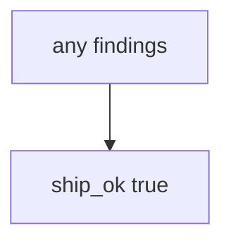

# Practice: always-true ship_ok

**Kind:** mechanism-lab
**Loop step:** 3 Break

## Try it

The practice is not a public repo you scan. `ship_ok` is a tiny Python helper that takes findings and a map. The failure is already in the function: it returns true for every pair. That true is a **failed rule**, not a green tile.

> An unmapped HIGH must not ship. If `ship_ok([{"id": "F1", "sev": "HIGH"}], {})` returns true, the ship gate has failed as a security control.

## Where you may practice

Stay inside `labs/9.4/9.4-lab` — in-process `ship_ok(findings, mappings)`. The finding id is the synthetic string `F1`. No live GitHub Advanced Security, no scanning other people’s repositories, no Dependabot against a public clinic.

Do not paste this exercise onto a public GitHub org, employer dashboard, or live clinic “to see what the scanner finds.”

What is supposed to stop this: `ship_ok` is supposed to **join scanner output to the coverage map**. A vendor default setup, a default Semgrep ruleset, and an empty dashboard are not enough.

Who can make this go wrong in this story: alert fatigue plus an always-true gate. That stands in for “code scanning is on and the dashboard is noisy so we ship Fridays,” a maturity score on a slide, or fifty unmapped HIGHs treated as probable false positives.

## Picture: every finding ships



You do not need a vendor console. You must not scan a public repo. The true return *is* the leak of the release decision.

The coverage lesson already said status is not coverage. This check is **unowned HIGH must not ship**.

## What to look at: the cause, not a hunt

`vulnerable/sast.py` returns true for every pair. Tests:

- `test_unmapped_high_blocks_ship`
- `test_mapped_high_may_ship` — a mapped HIGH may pass on both

You do not need a new finding id.

| What you see | What kind of failure | Not the lesson |
|---|---|---|
| `return True` for every pair | No join to the coverage map | “Code scanning is on” |
| `ship_ok([HIGH], {})` is true | Unmapped HIGH allowed to ship | A vendor dashboard |
| No map lookup | The gate accepted the finding | A maturity score on a slide |

## Why it happens vs what it costs

| Slice | Practice |
|---|---|
| The rule | `ship_ok([HIGH], {})` is false |
| Why it happens | Scanner output not joined to the coverage map |
| What has to be true first | `ship_ok` true for every pair |
| Trigger | Release with an unmapped HIGH |
| What it costs | Unknown HIGH in production |
| How you stop it later | Block unmapped HIGH; a mapped HIGH you accept still needs an exception with an expiry |
| How you notice later | `unmapped_high_blocks`; never the payload |
| How you recover later | Map it or fix it; do not hide it quietly |
| Out of scope | A product name, live GitHub, or claiming the verification gate is done |

A web framework will still ship if CI’s `ship_ok` is always true. What this practice is supposed to show: practice, empty map plus HIGH is deny.

## Practice

```text
python3 -m pytest labs/9.4/9.4-lab/tests --impl vulnerable
```

Run from `labs/9.4/9.4-lab` if a collection at the repo root picks up `site/`. Do not probe public hosts. A setup error is not proof the rule holds.

## Use it somewhere new

A clinic example: fifty unmapped HIGHs — predict without leaving this directory. Do not scan a live GitHub org.

## What this page is not doing

No live-target steps. Fake `F1` only. Do not dump real scanner payloads into the practice files. Do not “fix” the practice by deleting the test.
