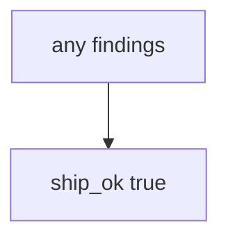

# 9.4-LO-03 — Observe always-true ship_ok, do not scan public repos

**Kind:** mechanism-lab
**Loop step:** 3 Break
**Standards:** OWASP ASVS 5.0.0 (final) `v5.0.0-15.2.1`. `v5.0.0-15.2.4` dependency confusion is **Level 3, advanced**. NIST SSDF 1.1 (final) PW.7 / PW.8. OWASP SAMM 2.0 as measurement vocabulary. SSDF 1.2 IPD is **draft**.

## Authorized scope

`labs/9.4/9.4-lab` only. The fixture is an in-process `ship_ok(findings, mappings)`. Synthetic finding id `F1`. No live GitHub Advanced Security, no scanning other people’s repositories, no Dependabot against a public clinic.

**Forbidden outcome:** Unmapped HIGH finding allows ship. `ship_ok([{"id": "F1", "sev": "HIGH"}], {})` returns true.

Attacker capability in this lab: alert fatigue plus an always-true gate. That stands in for “code scanning is on and the dashboard is noisy so we ship Fridays,” a SAMM score on a slide, or fifty unmapped HIGHs treated as probable false positives. Trust assumption: `ship_ok` is supposed to **join scanner output to the 9.1 map**. GitHub default setup, Semgrep defaults, and an empty dashboard are not in the TCB for this cell.

## Mental model: every finding ships



The vulnerable tree demonstrates **cause** (no join to 9.1). Do not run scanners against public targets. Preconditions: `ship_ok` returns true for every pair. You do not need GHAS. You must not scan a public repo.

ASVS `v5.0.0-15.2.1` wants components inside documented update timeframes — an SCA *signal*, not the map. Module 9.1 already said status is not coverage; this cell is **unowned HIGH must not ship**. Gate 9 stays **not-attempted**.

## What to read in the fixture

`vulnerable/sast.py` returns true for every pair. Tests:

- `test_unmapped_high_blocks_ship`
- `test_mapped_high_may_ship` — mapped HIGH may pass on both

You do not need a new finding id. The failure of `test_unmapped_high_blocks_ship` *is* the evidence.

Do not open the fixed tree yet. Diagnose the cause first.

## Root cause vs impact vs prevention vs detection vs recovery

| Slice | This lab |
|---|---|
| Required property | `ship_ok([HIGH], {})` is false |
| Root cause | Scanner output not joined to the 9.1 map |
| Preconditions | `ship_ok` true for every pair |
| Trigger | Release with unmapped HIGH |
| Impact | Unknown HIGH in prod |
| Prevention | Block unmapped HIGH; mapped+accepted needs E6 expiry |
| Detection | `unmapped_high_blocks`; never the payload |
| Recovery | Map or fix; do not silent-suppress |
| Not the lesson | A product name; live GHAS; Gate 9 complete |

## Framework defaults versus the ship guarantee

Code scanning “default setup” is inventory of *some* findings. Reachability may record a false positive — with an owner — it does not silently drop HIGH. FastAPI will still ship if CI’s `ship_ok` is always true. The application guarantee is: **this** fixture, empty map plus HIGH is deny.

## Practice

```text
python3 -m pytest labs/9.4/9.4-lab/tests --impl vulnerable
```

Run from `labs/9.4/9.4-lab` if a repo-root collection picks up `site/`. Record `test_unmapped_high_blocks_ship`. Do not probe public hosts. An environment error is not security evidence.

## Transfer

Clinic 50 unmapped HIGHs: predict without leaving this directory. Do not scan a live GitHub org.

## Non-goals

No live-target or vendor-tenant instructions. Do not claim Gate 9. SSDF 1.2 IPD stays labeled draft.
