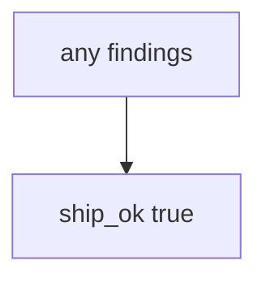

# 9.4-LO-03 — Observe always-true ship_ok, do not scan public repos

**Kind:** mechanism-lab
**Loop step:** 3 Break
**Standards:** OWASP ASVS 5.0.0 (final) `v5.0.0-15.2.1`.

## Authorized scope

`labs/9.4/9.4-lab` only. Synthetic finding id `F1`. No live GitHub Advanced Security, no scanning other people’s repositories.

**Forbidden outcome:** Unmapped HIGH finding allows ship.

## Mental model: every finding ships



The vulnerable tree demonstrates **cause** (no join to 9.1). Do not run scanners against public targets.

## What to read in the fixture

`vulnerable/sast.py` returns true for every pair. Tests require `ship_ok([HIGH], {})` to be false.

## Root cause vs impact

| Slice | Lab |
|---|---|
| Root cause | Scanner output not joined to the map |
| Impact | Unowned HIGH ships |
| Not the lesson | A product name as the definition |

## Practice

```
python3 -m pytest labs/9.4/9.4-lab/tests --impl vulnerable
```

Record `test_unmapped_high_blocks_ship`. Do not probe public hosts.

## Transfer

Clinic 50 unmapped HIGHs: predict without leaving this directory.

## Non-goals

No live-target or vendor-tenant instructions.
