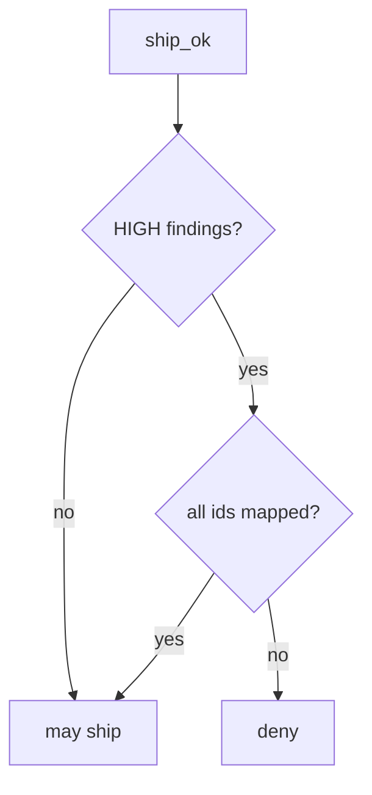

# 9.4-LO-04 — Require a mapping for every HIGH

**Kind:** design-exercise
**Loop step:** 4 Build
**Standards:** OWASP ASVS 5.0.0 (final) `v5.0.0-15.2.1`. NIST SSDF 1.1 RV.1.

## Structural means HIGH ids must appear in the map

`ship_ok` must be false unless every HIGH `id` is a key in `mappings`. Fail-safe: missing map is deny. LOW/INFO without a map may still ship in this lab — name that residual.

## Mental model: HIGH gate



Do not accept “dashboard is green” as a mapping.

## Why this restores the cell

| After the fix | Must be true |
|---|---|
| HIGH + empty map | `ship_ok` false |
| HIGH + `{F1: AUTHZ-1}` | `ship_ok` true |

## What this is not

GitHub default setup. SAMM. Reachability without an owner. Gate 9.

## Practice

Name the residual (unmapped LOW; authz blind spots). Run:

```
python3 -m pytest labs/9.4/9.4-lab/tests --impl fixed
```

Must pass.

## Transfer

SCA: mapping a CVE to “we do not call it” still records the owner.

## Residual risk

Wrong requirement id; `v5.0.0-15.2.4` Level 3; 9.2/9.3 for logic bugs.
