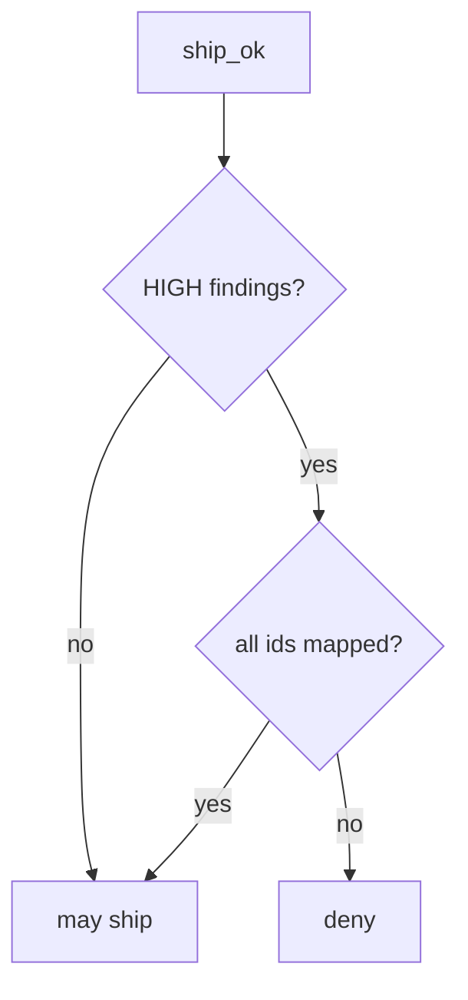

# 9.4-LO-04 — Require a mapping for every HIGH

**Kind:** design-exercise
**Loop step:** 4 Build
**Standards:** OWASP ASVS 5.0.0 (final) `v5.0.0-15.2.1`. NIST SSDF 1.1 (final) RV.1. `v5.0.0-15.2.4` is **Level 3, advanced**. SSDF 1.2 IPD is **draft**.

## Structural means HIGH ids must appear in the map

`ship_ok` must be false unless every HIGH `id` is a key in `mappings`. Fail-safe: missing map is deny. Structural means that join — not “dashboard is green,” not GitHub default setup, not a SAMM score.

The smallest restore for SecureCollab’s ship gate is: HIGH + empty map → deny. LOW/INFO without a map may still ship in this lab — name that residual. Do not fail open because the scanner job ran. Do not accept “dashboard is green” as a mapping.

## Mental model: HIGH gate



The lab’s fixed tree requires every HIGH `id` in `mappings`. Production still needs the mapped requirement to be the *right* 9.1 cell — mapping F1 to a leftover inventory row is a lying map. Authz logic (1.2 / 4.4) is a scanner blind spot: 9.2 / 9.3 still required. `v5.0.0-15.2.4` (dependency confusion) is Level 3 advanced: mapping “no finding” is not coverage. Mapped HIGH that is accepted still needs E6 expiry.

SSDF 1.1 RV.1 wants findings triaged. This pytest is that sentence for unmapped HIGH.

## Why this restores the cell

| After the fix | Must be true |
|---|---|
| HIGH + empty map | `ship_ok` false |
| HIGH + `{F1: AUTHZ-1}` | `ship_ok` true |

## What this is not

GitHub default setup. SAMM. Reachability without an owner. Gate 9. Dependabot as the map. Severity downgrade without evidence.

## Mechanism limits

- Authz logic (1.2 / 4.4) is a scanner blind spot — 9.2 / 9.3.
- Severity downgrade without evidence.
- Mapped HIGH that is the wrong requirement id.
- Unmapped LOW/INFO in this lab.
- `v5.0.0-15.2.4` Level 3 confusion grain.

## Practice

Name the residual (unmapped LOW; authz blind spots). Run:

```text
python3 -m pytest labs/9.4/9.4-lab/tests --impl fixed
```

Must pass. Run from the lab directory if collection at repo root is polluted.

## Transfer

SCA: mapping a CVE to “we do not call it” still records the owner.

## Residual risk

Wrong requirement id; `v5.0.0-15.2.4` Level 3; 9.2/9.3 for logic bugs; mass suppressions; E6.

## Non-goals

Do not scan a public repo. Do not claim Gate 9 from a scanner screenshot. Do not present SSDF 1.2 IPD as final.
