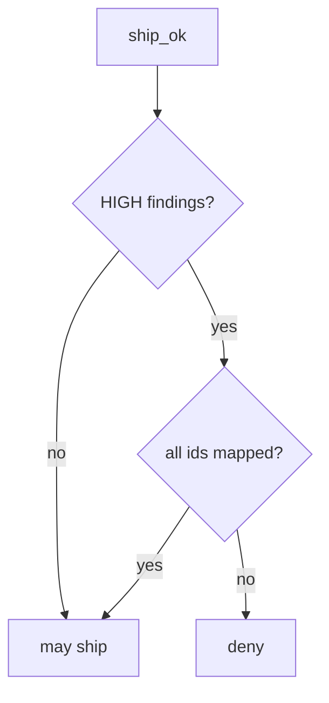

# Require a mapping for every HIGH

**Kind:** design-exercise
**Loop step:** 4 Build

## The rule

A green dashboard does not map HIGH findings. Turning off the scanner does not write the map. Turning on code scanning is not enough.

Do this: `ship_ok` **is false unless every HIGH `id` is a key in `mappings`**. Missing map is deny. In short, that join — not “the dashboard is green,” not a vendor default setup, not a maturity score.

Restore the notes app’s ship check with this: HIGH plus empty map → deny. LOW and INFO without a map may still ship in this lab — name that leftover. A scanner job running does not map HIGH findings. A green dashboard does not count as a mapping.

## Picture: HIGH gate



Every HIGH `id` has to appear in `mappings`. Mapping F1 to a leftover inventory row is a lying map. Who-is-allowed logic is a scanner blind spot: you still need review and isolation tests. Dependency confusion is an advanced leftover: mapping “no finding” is not coverage. A mapped HIGH you accept still needs an exception with an expiry.

A triage checklist wants findings owned — unmapped HIGH.

## What the repaired files must show

`fixed/sast.py` is the unmapped-HIGH join, not a scanner product.

| After the fix | Must be true |
|---|---|
| HIGH + empty map | `ship_ok` false |
| HIGH + `{F1: AUTHZ-1}` | `ship_ok` true |

By default, if you are unsure whether a HIGH is mapped, deny. A quiet Friday dashboard does not mean it may ship.

## What this is not

- A vendor default setup.
- A maturity score.
- Reachability without an owner.
- This check-in.
- Dependabot as the map.
- A severity downgrade with no evidence.

## What the tool cannot do

- Who-is-allowed logic is a scanner blind spot — you still need review and isolation tests.
- A severity downgrade with no evidence.
- A mapped HIGH that points at the wrong requirement id.
- Unmapped LOW and INFO in this lab.
- Dependency confusion as an advanced leftover.

## Can people still use it

The triage screen must say *why* F1 is blocked, in words. Do not encode “blocked” as color only, or people will mass-suppress.

## Practice

Name the leftover (unmapped LOW; who-is-allowed blind spots). Run:

```text
python3 -m pytest labs/9.4/9.4-lab/tests --impl fixed
```

## Use it somewhere new

SCA: mapping a CVE to “we do not call it” still records the owner.

## What can still go wrong

Wrong requirement id. Dependency confusion as an advanced leftover. Isolation tests still required. Mass suppressions. Exceptions with expiry.
