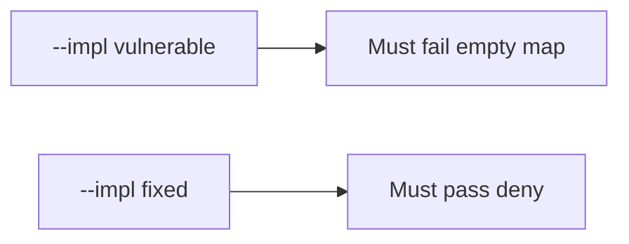

# 9.4-LO-05 — Evidence is unmapped HIGH denied, then a passing pair

**Kind:** verification-lab
**Loop step:** 5 Verify
**Standards:** OWASP ASVS 5.0.0 (final) `v5.0.0-15.2.1`.

## An invariant that cannot fail a test is still a slogan

“Code scanning on” is not evidence. The oracle is the local pair. Do not scan public repos.

## Mental model: vulnerable must fail: empty map

The failing observation on `--impl vulnerable` is **empty map**. A passing collection count is not this cell.



| Case | Must show |
|---|---|
| Negative / abuse | unmapped HIGH → not ship |
| Normal | mapped HIGH → may ship |
| Not claimed | real GHAS; Gate 9; SAMM |

```
python3 -m pytest labs/9.4/9.4-lab/tests --impl vulnerable
python3 -m pytest labs/9.4/9.4-lab/tests --impl fixed
```

Honest mapped HIGH may pass on both.

## What the tests do not prove

- That the mapped requirement is the right cell (9.1)
- That a 9.3 isolation test exists
- Live SCA reachability

## Practice

Execute both implementations. Map each test to an LO-02 cell.

## Transfer

Clinic: a test that only asserts “scanner job ran” is not this cell.
