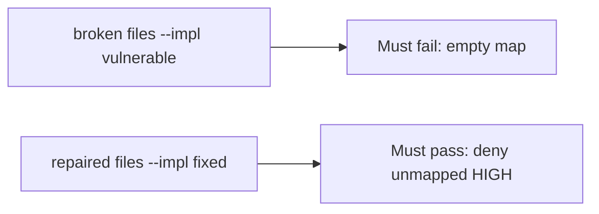

# Fail on the broken files, then pass on the repaired ones

**Kind:** verification-lab
**Loop step:** 5 Verify

## If you cannot test it, it is still a slogan

“Code scanning on” is not evidence. “We have a high maturity score” is a tool observation. The check is: `ship_ok([HIGH], {})` is false and a mapped HIGH may ship. That empty-map observation must be **false** on the broken files and **true** on the repaired files. Do not scan public repos.

## Picture: a broken ship_ok must fail the check

A test that only counts passing tests can pass while unmapped HIGH still ships. This check asks whether an unmapped HIGH still counts as a passing control. Broken must fail that question. Repaired must pass it.



If both pass, the test is not looking at the empty map. If both fail, the fix is not structural or the check is wrong.

## Four modes, even for a ship dict

| Mode | Must show for this topic |
|---|---|
| Normal | Mapped HIGH may ship (may pass on both) |
| Wrong input | Unmapped HIGH → not ship; broken files must fail |
| Abuse | Suppression with no owner is still deny (leftover if not in this pytest) |
| Not claimed | A real GitHub tenant; the verification gate; a maturity score; that the mapped requirement is the right cell |

The file is `labs/9.4/9.4-lab/tests/test_property.py`. The test `test_unmapped_high_blocks_ship` is a **what-must-not-happen** test: always-true `ship_ok` is not allowed to count as a passing control.

Honest mapped HIGH may pass on both implementations. That does not excuse the empty-map deny test. If the broken files do not fail `test_unmapped_high_blocks_ship`, the lab is miswired — fix the wiring, not the assertion.

```text
python3 -m pytest labs/9.4/9.4-lab/tests --impl vulnerable
python3 -m pytest labs/9.4/9.4-lab/tests --impl fixed
```

A test that only greps a scanner name in a workflow without calling `ship_ok([HIGH], {})` is not this topic’s evidence. This practice never opens a live GitHub org.

## What the tests do not prove

- That the mapped requirement is the right coverage-map cell
- That an isolation test exists
- Live SCA reachability
- Dependency confusion as an advanced leftover
- That the verification gate is done

Record those as leftover or later topics, not as silent passes.

## Practice

Run both this session from the lab directory if needed:

```text
python3 -m pytest labs/9.4/9.4-lab/tests --impl vulnerable
python3 -m pytest labs/9.4/9.4-lab/tests --impl fixed
```

Paste nothing from answer keys. Write fail/pass into your notes next to the HIGH×map row. Reject a “test” that only greps `codeql` in a workflow without calling `ship_ok([HIGH], {})`.

## Use it somewhere new

Clinic: a test that only asserts “scanner job ran” is not this topic. A live GitHub tenant is out of scope.

## What this page is not doing

Do not add a live org trophy. Do not log secret-scanner payloads. Answer keys are not on this site.
