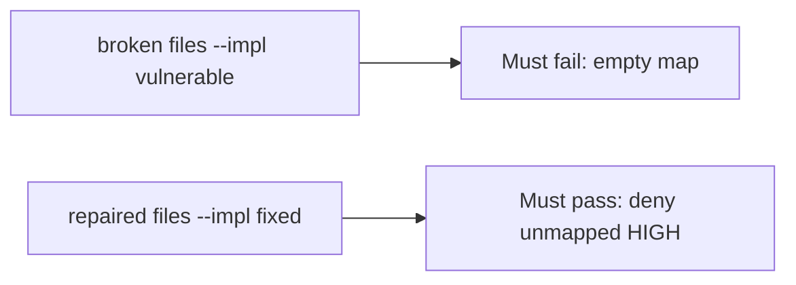

# A broken ship_ok must fail the check

**Kind:** verification-lab
**Loop step:** 5 Verify

## Check it

Turning on code scanning does not map HIGH findings. A high maturity score is a dashboard. `ship_ok([HIGH], {})` has to be false, and a mapped HIGH may ship. The leftover files: the empty map still ships. Repair blocks an unmapped HIGH. Do not scan public repos.

## Picture: a broken ship_ok must fail the check

Unmapped HIGH can still ship even when the suite is green.



If the broken ship check still passes, the empty owner map was never a block.

## What the check has to show

| Mode | Must show for this topic |
|---|---|
| Normal | Mapped HIGH may ship (may pass on both) |
| Wrong input | Unmapped HIGH → not ship; broken files must fail |
| Abuse | Suppression with no owner is still deny (leftover if not in this check) |
| Not claimed | A real GitHub tenant; this check-in; a maturity score; that the mapped requirement is the right row |

`test_unmapped_high_blocks_ship` exists so `ship_ok` cannot ignore an unmapped HIGH.

Do not let a HIGH with an owner on the map hide the leftover. Deny an unmapped HIGH. If the broken files do not fail `test_unmapped_high_blocks_ship`, the lab is miswired — fix the wiring, not the assertion.

```text
python3 -m pytest labs/9.4/9.4-lab/tests --impl vulnerable
python3 -m pytest labs/9.4/9.4-lab/tests --impl fixed
```

A scanner name in a workflow is not `ship_ok([HIGH], {})`. This practice never opens a live GitHub org.

## What the tests do not prove

- That the mapped requirement is the right coverage-map row
- That an isolation test exists
- Live SCA reachability
- Dependency confusion as an advanced leftover
- That this check-in is done

## Practice

Call `ship_ok([HIGH], {})`. A `codeql` job in a workflow is the scanner, not the map.

## Use it somewhere new

A scanner job that ran is the workflow, not a mapped HIGH. Do not use a live GitHub tenant.

## What this page is not doing

A live org screenshot is not a mapped HIGH. Do not log secret-scanner payloads. Answer keys are not on this site.
