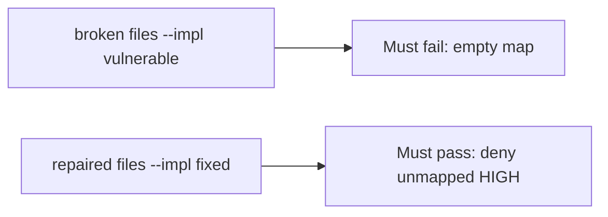

# A broken ship_ok must fail the check

**Kind:** verification-lab
**Loop step:** 5 Verify

## Check it

“Code scanning on” is not evidence. “We have a high maturity score” is a tool observation. The check is: `ship_ok([HIGH], {})` is false and a mapped HIGH may ship. That empty-map observation must be **false** on the broken files and **true** on the repaired files. Do not scan public repos.

## Picture: a broken ship_ok must fail the check

A passing-test tally can still hide that unmapped HIGH still ships.



If both pass, you are not looking at the empty map.

## What the check has to show

| Mode | Must show for this topic |
|---|---|
| Normal | Mapped HIGH may ship (may pass on both) |
| Wrong input | Unmapped HIGH → not ship; broken files must fail |
| Abuse | Suppression with no owner is still deny (leftover if not in this check) |
| Not claimed | A real GitHub tenant; the verification gate; a maturity score; that the mapped requirement is the right row |

The test `test_unmapped_high_blocks_ship` is there so always-true `ship_ok` still fails.

Honest mapped HIGH may pass on both implementations. That does not excuse the empty-map deny test. If the broken files do not fail `test_unmapped_high_blocks_ship`, the lab is miswired — fix the wiring, not the assertion.

```text
python3 -m pytest labs/9.4/9.4-lab/tests --impl vulnerable
python3 -m pytest labs/9.4/9.4-lab/tests --impl fixed
```

Searching for a scanner name in a workflow without calling `ship_ok([HIGH], {})` is not evidence. This practice never opens a live GitHub org.

## What the tests do not prove

- That the mapped requirement is the right coverage-map row
- That an isolation test exists
- Live SCA reachability
- Dependency confusion as an advanced leftover
- That the verification gate is done

## Practice

Do not treat a grep for `codeql` in a workflow as the check. Call `ship_ok([HIGH], {})`.

## Use it somewhere new

Asserting “scanner job ran” is not this check. Do not use a live GitHub tenant.

## What this page is not doing

Do not treat a live org screenshot as proof. Do not log secret-scanner payloads. Answer keys are not on this site.
