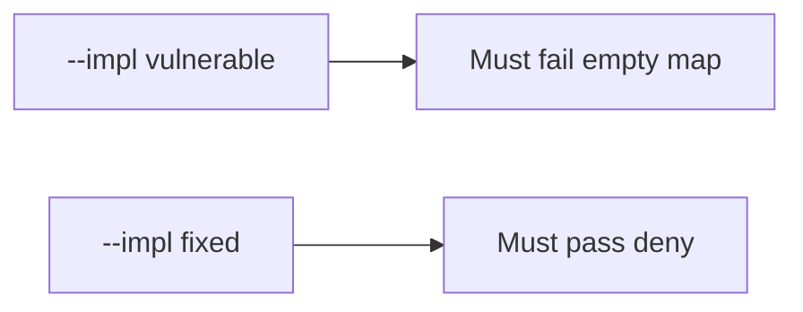

# 9.4-LO-05 — Evidence is unmapped HIGH denied, then a passing pair

**Kind:** verification-lab
**Loop step:** 5 Verify
**Standards:** OWASP ASVS 5.0.0 (final) `v5.0.0-15.2.1`.

## An invariant that cannot fail a test is still a slogan

“Code scanning on” is not evidence. “SAMM is Level 3” is a mechanism observation. The oracle is: `ship_ok([HIGH], {})` is false and mapped HIGH may ship. The empty-map observation must be **false** on `--impl vulnerable` (returns true) and **true** on `--impl fixed`. Do not scan public repos.

## Mental model: vulnerable must fail: empty map

The failing observation on `--impl vulnerable` is **empty map**. A passing collection count is not this cell.



| Mode | Must show for this module |
|---|---|
| Negative / abuse | unmapped HIGH → not ship; vulnerable must fail |
| Normal | mapped HIGH → may ship (may pass on both) |
| Not claimed | real GHAS; Gate 9; SAMM; that the mapped req is the right cell |

Lab tests in `labs/9.4/9.4-lab/tests/test_property.py`. `test_unmapped_high_blocks_ship` is a **forbidden-outcome** test: always-true `ship_ok` is not allowed to count as a passing control.

```text
python3 -m pytest labs/9.4/9.4-lab/tests --impl vulnerable
python3 -m pytest labs/9.4/9.4-lab/tests --impl fixed
```

Honest mapped HIGH may pass on both implementations. That does not excuse the empty-map deny test. If vulnerable does not fail `test_unmapped_high_blocks_ship`, the lab is miswired—fix the wiring, not the assertion.

## What the tests do not prove

- That the mapped requirement is the right cell (9.1)
- That a 9.3 isolation test exists
- Live SCA reachability
- `v5.0.0-15.2.4` Level 3 confusion
- Gate 9 complete

Record those as residuals or later modules, not as silent passes.

## Practice

Execute both implementations this session from the lab directory if needed. Write the fail/pass pair next to the matrix row. Reject a “test” that only greps `codeql` in a workflow without calling `ship_ok([HIGH], {})`.

## Transfer

Clinic: a test that only asserts “scanner job ran” is not this cell. A live GHAS tenant is out of scope.

## Non-goals

Do not add a live org trophy. Do not log secret-scanner payloads. Keys stay out of this file. Gate 9 stays not-attempted.
