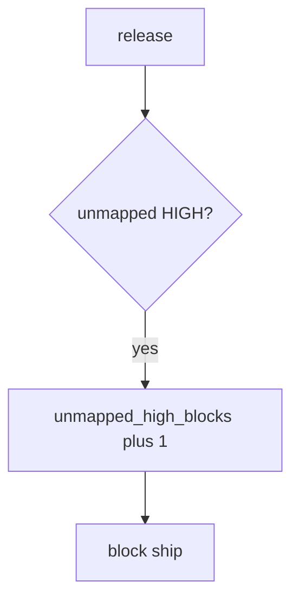

# Block the unmapped HIGH without logging payloads

**Kind:** operations-exercise
**Loop step:** 6 Operate

## Fixing it once is not enough

A new rule can fire a new HIGH after `ship_ok` was “fixed once.” Do not log secret-scanner payloads or note bodies. Do not paste scanner snippets with fake clinic text into Slack.

## Picture: unmapped HIGH is a signal

When you see a blocked ship, name the finding id. Leave the finding payload off the pager. Then map or fix.



A scanner product is not the rule, and an owned-finding badge is not proof.

Re-run `test_unmapped_high_blocks_ship` after any scanner-rule change. A green “code scanning on” tile is not that check. SCA CVEs that are not actually called still need an *owner* on the map — inventory them before you claim recover.

## Signals that do not become a second leak

| Outcome | This topic |
|---|---|
| Notice | `unmapped_high_blocks` |
| What the line holds | Finding id, severity, missing requirement; **never** the payload |
| Respond | Stop the ship; do not paste the matching snippet into chat |
| Recover | Map it or fix it; do not hide it quietly |
| Leftover | Who-is-allowed blind spots; exceptions with expiry; mass suppressions |

A vendor security dashboard will show finding counts and stay silent when CI’s `ship_ok` is always true. Detection must observe **empty map plus HIGH is deny**, not alert volume. If the alert includes a secret or a note body, you have opened the same leak as a log line and an extra vendor copy.

```text
log_denied reason=unmapped_high_blocks finding=F1 sev=HIGH
```

Not: a secret, a note body, or “verification gate complete.”

Putting the matching scanner snippet in the alert puts the finding payload in the pager too.

## What the framework does vs what you still have to check

The same who-is-allowed holes that bypass this practice will also bypass a “scan our dashboard” detector.

## Can people still use it

The triage screen must say *why* F1 is blocked, in words. Do not encode “blocked” as color only, or people will mass-suppress. If operators see a blocked-ship badge, do not encode it as color only.

The **cause** is CI’s `ship_ok` still always true (or a new HIGH with no map row); the **cost** is an unowned HIGH in production; **how you stop it** is the join; **how you notice** is `unmapped_high_blocks`; **how you recover** is map-or-fix, not a quiet severity downgrade. What the tool cannot do: this alert does not prove the mapped requirement is the right coverage-map row, and it does not cover who-is-allowed blind spots.

## Practice

```text
log_denied reason=unmapped_high_blocks finding=F1 sev=HIGH
```

Reject any line that includes a secret, a note body, or “verification gate complete.”

## Use it somewhere new

Block a release with fifty unmapped HIGHs; do not paste scanner snippets with fake patient text into Slack. Do not scan a live org.

## What this page is not doing

Do not use live org traces. Answer keys are not on this site.
