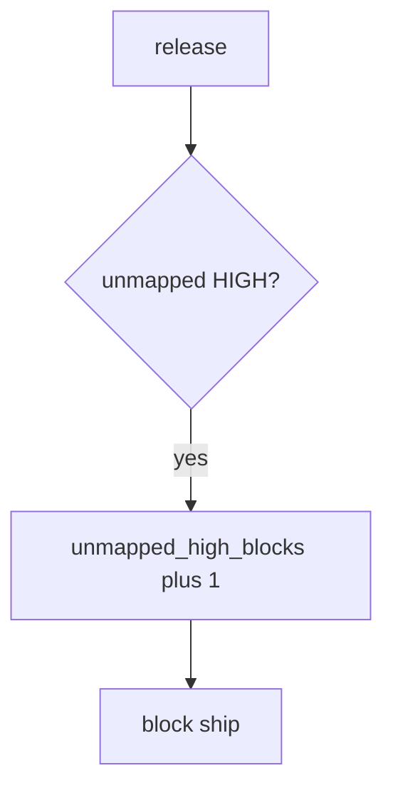

# 9.4-LO-06 — Detect unmapped_high_blocks without logging payloads

**Kind:** operations-exercise
**Loop step:** 6 Operate
**Standards:** NIST CSF 2.0 (final) DE/RS/RC as outcome labels; NIST SSDF 1.1 (final) RV.1. ASVS 5.0.0 (final) `v5.0.0-15.2.1`.

## Prevention is not absolute

A new rule can fire a new HIGH after `ship_ok` was “fixed once.” Pair detect and recover. Do not log secret-scanner payloads or note bodies (3.1 / 5.3). Do not paste scanner snippets with PHI into Slack.

## Mental model: unmapped HIGH is a signal



| Outcome | This module |
|---|---|
| Detect | `unmapped_high_blocks` |
| Signal | finding id, sev, missing req; never the payload |
| Recover | Map or fix; do not silent-suppress |
| Residual | Authz blind spots; E6 exceptions; mass suppressions |

CSF 2.0 Detect / Respond / Recover name outcomes. They do not prove RV.1. A scanner-vendor name is not the property. Re-run `test_unmapped_high_blocks_ship` after any scanner-rule change; a green “code scanning on” tile is not that pytest. SCA CVEs that are not actually called still need an *owner* on the map — inventory them before claiming Recover.

## Framework defaults versus the operate guarantee

A GitHub Security dashboard will show finding counts and stay silent when CI’s `ship_ok` is always true. Detection must observe **empty map plus HIGH is deny**, not alert volume. If the alert includes a secret or a note body, you have opened a 3.1 / 5.3 cell.

## Practice

Write one log line you would accept. Tie it to `labs/9.4/9.4-lab`.

```text
log_denied reason=unmapped_high_blocks finding=F1 sev=HIGH
```

Reject any line that includes a secret, a note body, or “Gate 9 complete.”

## Transfer

Clinic: block a release with 50 unmapped HIGHs; do not paste scanner snippets with PHI into Slack. Do not scan a live org.

## Usability

Triage UI must be usable or people mass-suppress (WCAG 2.2 Success Criterion 4.1.3: say *why* F1 is blocked).

Cause vs impact stays split here too: the **cause** is CI’s `ship_ok` still always true (or a new HIGH with no map row); the **impact** is an unowned HIGH in prod; **prevention** is the join; **detection** is `unmapped_high_blocks`; **recovery** is map-or-fix, not a silent severity downgrade. Mechanism limit: this alert does not prove the mapped requirement is the right 9.1 cell, and it does not cover authz blind spots (9.2 / 9.3).

## Non-goals

A scanner-vendor name is not the property. Gate 9 stays not-attempted.
