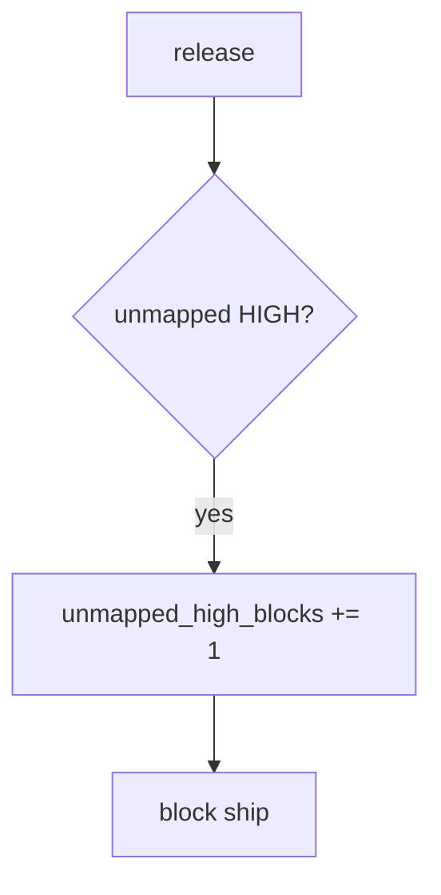

# 9.4-LO-06 — Detect unmapped_high_blocks without logging payloads

**Kind:** operations-exercise
**Loop step:** 6 Operate
**Standards:** NIST CSF 2.0 (final) DE/RS/RC as outcome labels; NIST SSDF 1.1 RV.1.

## Prevention is not absolute

A new rule can fire a new HIGH. Pair detect and recover. Do not log secret-scanner payloads or note bodies (3.1 / 5.3).

## Mental model: unmapped HIGH is a signal



| Outcome | This module |
|---|---|
| Detect | `unmapped_high_blocks` |
| Signal | finding id, sev, missing req; never the payload |
| Recover | Map or fix; do not silent-suppress |
| Residual | Authz blind spots; E6 exceptions |

## Practice

Write one log line you would accept. Tie it to `labs/9.4/9.4-lab`.

```
log_denied reason=unmapped_high_blocks finding=F1 sev=HIGH
```

Reject any line that includes a secret, a note body, or “Gate 9 complete.”

## Transfer

Clinic: block a release with 50 unmapped HIGHs; do not paste scanner snippets with PHI into Slack.

## Non-goals

A scanner-vendor name is not the property. Gate 9 stays not-attempted.
