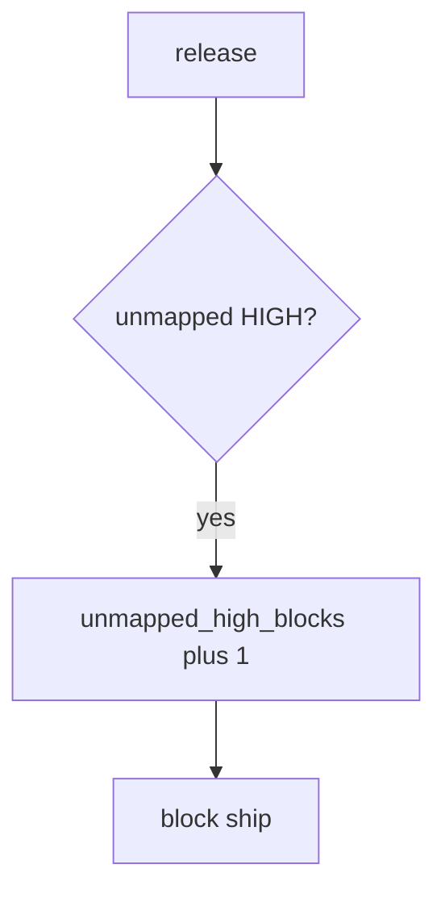

# Block the unmapped HIGH without logging payloads

**Kind:** operations-exercise
**Loop step:** 6 Operate

## Fixing it once is not enough

A new scanner rule can fire a HIGH that nobody owns. Keep secret-scanner payloads and note bodies out of Slack, including fake clinic snippets.

## Picture: unmapped HIGH is a signal

If ship is blocked, page the finding id — not the finding payload. Then map it or fix it.



Turning on a scanner does not assign an owner to the HIGH.

An unmapped HIGH still has to block ship in `test_unmapped_high_blocks_ship`. Turning code scanning on does not own the HIGH. SCA CVEs that are not actually called still need an *owner* on the map; do not ship an unmapped HIGH.

## Signals that do not become a second leak

| Outcome | This topic |
|---|---|
| Notice | `unmapped_high_blocks` |
| What the line holds | Finding id, severity, missing requirement; **never** the payload |
| Respond | Stop the ship; do not paste the matching snippet into chat |
| Recover | Map it or fix it; do not hide it quietly |
| Leftover | Who-is-allowed blind spots; exceptions with expiry; mass suppressions |

A vendor security dashboard will show finding counts and stay silent when CI’s `ship_ok` is always true. Detection must observe **empty map plus HIGH is deny**, not alert volume. If the alert includes a secret or a note body, you have opened the same leak as a log line and an extra vendor copy.

```text
log_denied reason=unmapped_high_blocks finding=F1 sev=HIGH
```

If the sample still contains a secret, a note body, or “verification gate complete,” you have filed the finding twice.

The unmapped-HIGH ticket needs the finding id, not the scanner snippet.

## What the framework does vs what you still have to check

Who-is-allowed holes still ship under a green scanner dashboard if no owner is on the map.

## Can people still use it

The triage screen must say *why* F1 is blocked, in words. Do not encode “blocked” as color only, or people will mass-suppress. If operators see a blocked-ship badge, do not encode it as color only.

It broke because CI’s `ship_ok` still always true (or a new HIGH with no map row). Cost: an unowned HIGH in production. Fix: the join. Signal: `unmapped_high_blocks`. Recovery: map-or-fix, not a quiet severity downgrade. The ticket does not prove the mapped requirement is the right coverage-map row, and it does not cover who-is-allowed blind spots.

## Practice

```text
log_denied reason=unmapped_high_blocks finding=F1 sev=HIGH
```

Unmapped-HIGH denials name the finding id. A secret, a note body, or “verification gate complete” is a second scanner dump.

## Use it somewhere new

Block a release with fifty unmapped HIGHs; do not paste scanner snippets with fake patient text into Slack. Do not scan a live org.

## What this page is not doing

Do not use live org traces. Answer keys are not on this site.
