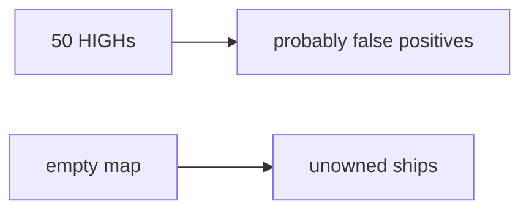

# Same idea on fifty unmapped clinic findings

**Kind:** transfer-challenge
**Loop step:** 7 Transfer

## Use it somewhere new

You get a **clinic dashboard**. Fifty HIGH findings sit unmapped.

`ship_ok([HIGH], {})` must be false. For a clinic, finding × map, allow or deny. A noisy dashboard is still noise, not a map.

An EHR-lite “code scanning is on and the dashboard is noisy so we ship Fridays,” plus a maturity score on a slide.

## Picture: same join, clinical object

Own the clinic HIGH the way you own a notes-app finding. Enabling code scanning without a mapping check does not own the HIGH.

| Notes app | Clinic sketch |
|---|---|
| HIGH finding is unowned until mapped | Same — fifty unmapped HIGHs |
| Coverage-map requirement id | Same join, clinic requirement names |
| `ship_ok([HIGH], {})` | `ship_ok` on local practice files |
| Alert-fatigued reviewer | Same reader — **not** a live clinic |
| Empty map ships the finding | Empty map ships the finding |

If the dashboard is noisy while `ship_ok` is always true, the rule is gone. A vendor default setup, a maturity score, and Dependabot do not join F1 to AUTHZ-1. SCA “we do not call that function” still records an owner — name it, do not scan a live org here. Who-is-allowed blind spots remain review and isolation tests.

An unmapped HIGH still has to be denied. A mapped HIGH may still ship. Enabling code scanning without a mapping check leaves `ship_ok([HIGH], {})` true. The local check is `test_unmapped_high_blocks_ship` — on a practice, not a live GitHub tenant.

Also name SCA: a CVE versus a function you actually call.

## Write this for a clinic with fifty unmapped HIGHs

1. who might try (alert fatigue — not a live clinic);
2. what you trust (the mapping check is the promise; the dashboard and a maturity score are not);
3. what must not happen (`ship_ok([HIGH], {})` true);
4. run it on **local** practice files only (no live GitHub);
5. leftover (who-is-allowed blind spots, dependency confusion as an advanced leftover, mass suppressions);
6. whether a human triage path exists (must say *why* F1 is blocked, in words).

Use fake labels. Do not use real patient findings.

## What is not good enough

| Reject | Why |
|---|---|
| “The scanner is on” | Signal, not ownership |
| Live GitHub org / public SCA | Course rules |
| A maturity score as `ship_ok` | Measurement, not the check |
| Empty dashboard as isolation | Wrong observation |
| A draft supply-chain paper as a certificate | Draft; not the verification gate |

## Practice

Map every HIGH before you ship. Keep the answer keys closed. `labs/9.4/9.4-lab` is the only running system you may break. Do not scan a public host.

## What this page is not doing

Do not try live-target scanning. Do not use real patient findings. This page does not finish the verification gate.
